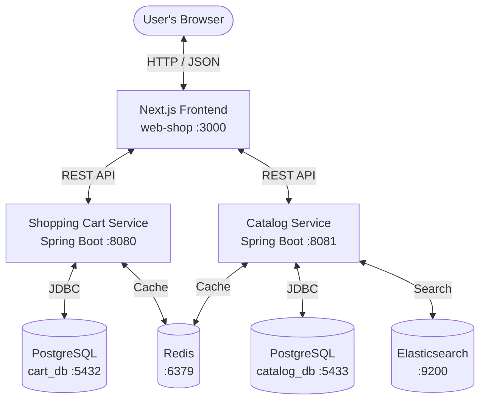

# 🌌 Abysalto Webshop

Welcome to the **Abysalto Webshop** ecosystem—a state-of-the-art microservices-based e-commerce platform. This project showcases a robust, high-performance architecture built with modern backend and frontend technologies.

---

## 🏗️ Architecture Overview

The platform is designed with a decoupled, containerized architecture:



### Key Components
1. **Next.js Web Frontend (`web-shop`)**: A modern, responsive web application utilizing React 18+ and Next.js, optimized for quick rendering and a premium user experience.
2. **Shopping Cart Service (`shopping-cart-service`)**: A Spring Boot 3.x microservice managing user sessions, active carts, checkout processes, and metrics tracking.
3. **Catalog Service (`catalog-service`)**: A Spring Boot 3.x microservice providing product catalog management, paginated results, and inventory lookups.
4. **Data & Infrastructure Tier**:
   - **PostgreSQL**: Independent databases for shopping cart data (`cart_db`, port `5432`) and catalog data (`catalog_db`, port `5433`).
   - **Redis Cache**: High-speed, in-memory caching tier shared across microservices.
   - **Elasticsearch**: Full-text and fast-search indexer powering product search queries.

---

## 📋 System Requirements

To build and run this project, make sure you have the following installed:

| Prerequisite | Recommended Version | Purpose |
| :--- | :--- | :--- |
| **Docker & Docker Compose** | Desktop 4.x+ / Compose v2+ | Orchestrates databases, caching, search indices, and service containers |
| **Java Development Kit (JDK)** | Java 21 (LTS) | Required only if running backend services natively/locally |
| **Node.js** | Node 18+ & npm 9+ | Required only if running the Next.js frontend natively/locally |
| **Gradle** | 8.7+ | Required only if building backend microservices natively/locally |

---

## 🚀 Quick Start (Using Docker Compose)

The fastest and most reliable way to spin up the entire ecosystem (databases, caching, backend microservices, search, and frontend) is through Docker Compose.

### 1. Build and Start the Entire Stack
Run the following command at the root directory of the repository:
```bash
docker compose up --build
```

### 2. Access the Application & Services
Once all containers show a green/healthy status, you can access them at:

* **Next.js Frontend**: [http://localhost:3000](http://localhost:3000)
* **Shopping Cart API**: [http://localhost:8080](http://localhost:8080)
  - **Swagger UI**: [http://localhost:8080/swagger-ui/index.html](http://localhost:8080/swagger-ui/index.html)
  - **OpenAPI Spec**: [http://localhost:8080/v3/api-docs](http://localhost:8080/v3/api-docs)
* **Catalog Service API**: [http://localhost:8081](http://localhost:8081)
  - **Swagger UI**: [http://localhost:8081/swagger-ui/index.html](http://localhost:8081/swagger-ui/index.html)
  - **OpenAPI Spec**: [http://localhost:8081/v3/api-docs](http://localhost:8081/v3/api-docs)
* **Elasticsearch Node**: [http://localhost:9200](http://localhost:9200)

---

## 💻 Native Local Development (No Docker for Services)

If you wish to run the backend and frontend microservices natively on your machine, you must still have the database and caching tiers running (or adjust configurations to use embedded/H2 profiles).

### 1. Spin up Infrastructure Only
You can spin up only the database, Redis, and Elasticsearch containers to avoid running heavy services in Docker:
```bash
docker compose up -d db catalog-db redis elasticsearch
```

### 2. Run the Catalog Service Backend
```bash
# Windows
gradlew.bat :catalog-service:bootRun

# macOS / Linux
./gradlew :catalog-service:bootRun
```
*API is accessible at [http://localhost:8081](http://localhost:8081)*.

### 3. Run the Shopping Cart Service Backend
```bash
# Windows
gradlew.bat :shopping-cart-service:bootRun

# macOS / Linux
./gradlew :shopping-cart-service:bootRun
```
*API is accessible at [http://localhost:8080](http://localhost:8080)*.

### 4. Run the Next.js Frontend
```bash
cd web-shop
npm install
npm run dev
```
*Frontend is accessible at [http://localhost:3000](http://localhost:3000)*.

---

## 🧪 Running Tests

### Running Backend Tests in Docker (Zero Local Setup)
You can run the full Java unit and integration test suite inside a JDK 21 Docker container:

#### On Windows (PowerShell):
```powershell
docker run --rm -v "${PWD}:/app" -w /app gradle:8.7-jdk21-alpine gradle test --no-daemon
```

#### On Linux / macOS (Bash):
```bash
docker run --rm -v "$(pwd):/app" -w /app gradle:8.7-jdk21-alpine gradle test --no-daemon
```

### Running Backend Tests Locally
If you have Java 21 and Gradle/gradlew configured locally:
```bash
# Run tests for all projects
./gradlew test

# Run tests for a specific microservice
./gradlew :shopping-cart-service:test
./gradlew :catalog-service:test
```

---

## 📚 Architecture & Design Documentation

For a deep dive into the system's technical design, scaling strategies, and presentation slides, check out the following resources in the [doc/](doc/) directory:

- 📑 **[High-Level Design Document](doc/presentation_design_doc.md)**: A detailed design architecture covering technical stack selection, high-availability scaling strategy, security & OAuth2 policies, external integrations (ERP, marketplaces, fiscalization), and system telemetry.
- 🌍 **[Interactive Slide Presentation (Live Web)](https://drapic88.github.io/abysalto-webshop/doc/presentation.html)** (or view the [local file](doc/presentation.html)): An interactive, browser-rendered HTML slide deck summarizing the business goals, tech stack, and ecosystem overview.
- 📖 **Interactive API Documentation (OpenAPI / Swagger)**:
  - **Shopping Cart Service Specs**: [Swagger UI (local link)](http://localhost:8080/swagger-ui/index.html) | [Raw OpenAPI Spec (local link)](http://localhost:8080/v3/api-docs)
  - **Catalog Service Specs**: [Swagger UI (local link)](http://localhost:8081/swagger-ui/index.html) | [Raw OpenAPI Spec (local link)](http://localhost:8081/v3/api-docs)

---

## 📂 Project Structure

```
abysalto-webshop/
├── .github/                   # CI/CD Workflows (if applicable)
├── catalog-service/           # Product Catalog Spring Boot API
│   ├── src/main/java/         # Core logic, search indexers & DB entities
│   ├── src/test/java/         # Integration & Unit tests
│   └── build.gradle           # Build dependencies & configuration
├── doc/                       # System design docs & presentation slides
│   ├── presentation_design_doc.md # High-level design document
│   └── presentation.html      # Interactive slide presentation
├── shopping-cart-service/     # Shopping Cart & Checkout Spring Boot API
│   ├── src/main/java/         # Domain models, services & controller layers
│   ├── src/test/java/         # MockMvc & checkout flow tests
│   └── build.gradle           # Service-specific dependencies
├── web-shop/                  # Next.js Frontend Client (React)
│   ├── src/                   # Components, views, state & hooks
│   ├── public/                # Static assets & favicon
│   └── Dockerfile             # Production & Dev container setup
├── docker-compose.yml         # Local development orchestration template
├── settings.gradle            # Multi-project gradle build configuration
└── README.md                  # Ecosystem manual & guide
```