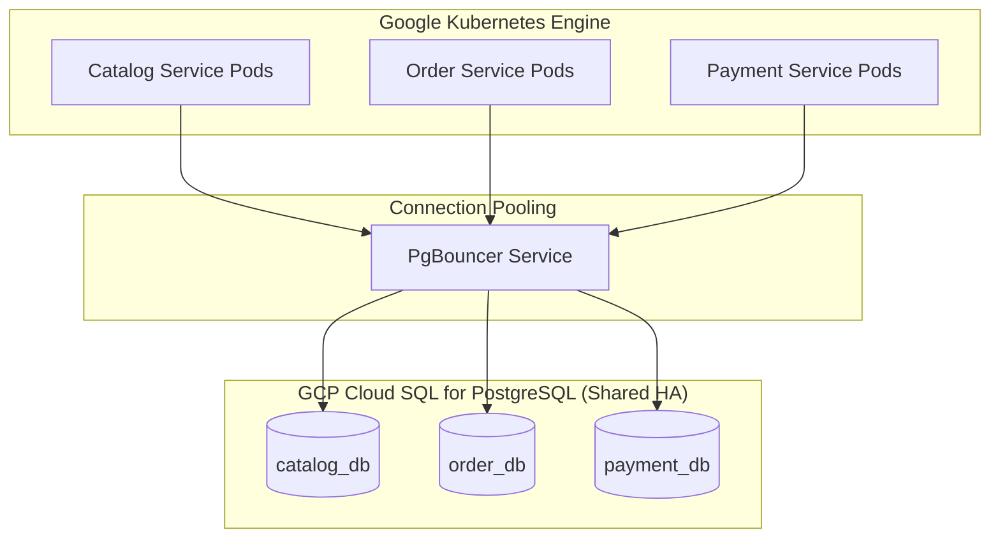

# ADR 0001: Logical Database-per-Service Isolation Strategy

## Status
**Accepted**

## Context
The Abysalto Webshop retail platform serves a global market with millions of active users daily and requires strong transactional consistency, high availability, and horizontal scalability. Two independent cross-functional teams will develop and maintain different service domains (Catalog, Orders & Checkout, Payments, Customer Profiles). 

We need a database architecture that:
1. Enforces strict schema isolation and boundaries between domain services to avoid tight coupling.
2. Supports high write throughput and sub-millisecond query performance.
3. Minimizes operational complexity and infrastructure costs compared to provisioning dedicated physical database servers for every single microservice.
4. Scale connections seamlessly without hitting PostgreSQL connection limits.

## Decision
We decided to adopt a **Logical Database-per-Service topology on a shared, High-Availability (HA) Google Cloud SQL for PostgreSQL instance**, gated by a **PgBouncer connection pooling layer** and authenticated using **GCP Workload Identity / IAM Database Authentication**.

### Key Implementation Guidelines
* **Zero Direct Joins:** Cross-database queries are strictly prohibited. If `Order Service` needs catalog data, it must request it via the gRPC APIs exposed by `Catalog Service`.
* **PgBouncer Layer:** pgBouncer runs as a lightweight connection pooler to prevent PostgreSQL's process-per-connection scaling bottleneck.
* **Workload Identity:** No raw database passwords will be stored in application configs. GKE service accounts are bound directly to IAM roles, enabling passwordless authentication.
* **UUID v4 for Primary Keys:** Non-sequential, cryptographically random 16-byte native PostgreSQL UUID types are mandated to avoid auto-increment collisions in distributed GKE environments.

## Consequences

### Positive (Benefits)
* **Domain Autonomy:** Teams A and B can modify, migrate, and deploy their schemas independently without risk of database-level conflicts.
* **Cost Efficiency:** Running a single multi-core High-Availability Cloud SQL PostgreSQL instance is substantially cheaper than running 4 or 5 separate HA instances.
* **Simplified Operations:** Backups, replication, upgrades, and maintenance are consolidated onto a single cloud resource.
* **No Shared State:** Eliminates the temptation of writing raw SQL queries across microservice schemas, enforcing clean API boundaries.

### Negative / Trade-offs
* **Shared Resource Contention:** CPU, Memory, and Disk I/O are shared. A slow, unindexed query in `order_db` could impact the performance of `catalog_db`. Mitigated by strict Query Performance Alerts and indexing best practices (like covering indexes with `INCLUDE`).
* **Connection Management:** Multiple services connecting to the same instance requires PgBouncer and careful parameter tuning (`max_connections`, pool size limits).
* **Single Point of Failure (Instance-level):** Although Cloud SQL is configured in High-Availability (HA) mode with automated multi-zone failover, a failure of the instance affects all services.
