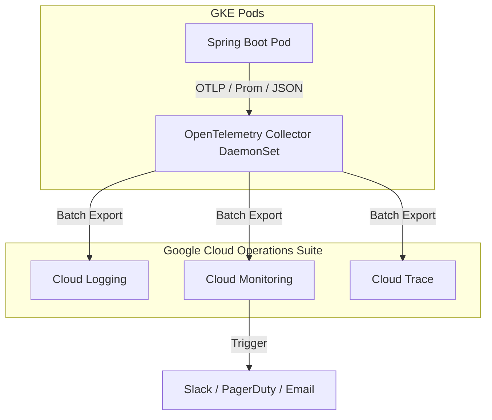

# ADR 0004: Monitoring & Observability Architecture

## Status
**Accepted**

## Context
With millions of active users daily and a distributed microservices architecture running on Google Kubernetes Engine (GKE) and connecting to segregated logical databases, detecting, diagnosing, and resolving issues in production can be extremely complex. 

An failure in the Checkout step could originate from:
- A network glitch in the Cloud API Gateway.
- A slow SQL query in `payment_db`.
- A serialization bug in the `order-service`.
- High CPU throttling in the `catalog-service` Pod.

We need a standardized, unified telemetry solution to achieve:
1. Distributed end-to-end tracing across GKE, Pub/Sub, and database layers.
2. Structured centralized logging.
3. Automated metrics collection and real-time alerting.
4. No vendor lock-in to external observability suites (like Datadog or New Relic) that charge exorbitant egress and per-host fees.

## Decision
We decided to adopt **OpenTelemetry** as the instrumentation standard, using **Micrometer** in Spring Boot, collected by a GKE **OpenTelemetry DaemonSet Collector**, and batch-exported natively to **Google Cloud Operations Suite** (Cloud Logging, Cloud Monitoring, and Cloud Trace).

### Key Technical Specifications
* **Distributed Tracing:** Micrometer Tracing intercepts and injects standard W3C `traceparent` headers into all outgoing HTTP, gRPC, and Pub/Sub requests. This propagates trace contexts seamlessly.
* **Structured Logs:** Spring Boot applications output logs in standardized **JSON formats** to `stdout`, which are scraped and indexed by Google Cloud Logging, preserving fields like `trace_id` and `span_id`.
* **Centralized Metrics:** GKE OpenTelemetry Collectors scrape Actuator endpoints (`/actuator/prometheus`) and send metrics to Cloud Monitoring.

## Consequences

### Positive (Benefits)
* **Zero Vendor Lock-in:** Since the instrumentation is built entirely on standard OpenTelemetry APIs, we can switch from Google Cloud Operations Suite to Datadog, Grafana Mimir, or Dynatrace in the future simply by updating the collector's export configuration without modifying a single line of backend application code.
* **Pinpoint Latency Tracking:** Developers can inspect an individual customer's checkout trace in Cloud Trace, observing hop-by-hop timings across the API gateway, microservices, Pub/Sub, and PostgreSQL database queries.
* **Cost Efficiency:** Using native GCP Operations Suite tools avoids cross-cloud data egress charges, which are a major expense when shipping high-volume telemetry to external SaaS providers.

### Negative / Trade-offs
* **Telemetry Volume & Storage Costs:** Millions of daily active users will generate terabytes of logs, metrics, and traces. To prevent skyrocketing GCP storage bills, we must implement trace sampling (e.g., sample only 5% of successful requests but 100% of errors/slow transactions) and set strict log retention filters.
* **Infrastructure Overhead:** Running the OpenTelemetry Collector DaemonSet consumes extra CPU/Memory resources on every GKE cluster node.
