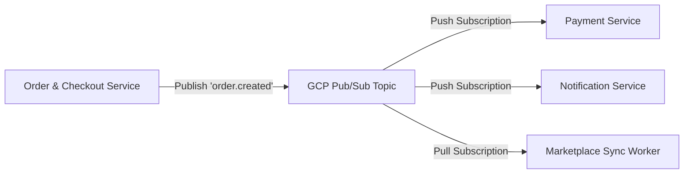

# ADR 0005: Event-Driven Architecture with Google Cloud Pub/Sub

## Status
**Accepted**

## Context
The Abysalto Webshop is built on a microservices architecture. Direct, synchronous HTTP/gRPC communication between services for every business flow creates tightly coupled systems, leading to:
1. **Cascading Failures:** If the `Notification Service` or external payment validation is down, checkout fails.
2. **Poor Performance:** A checkout transaction must block and wait for multiple downstream tasks (sending email, updating search indexes, synchronizing inventory with third-party marketplaces) before returning a response to the user.
3. **Difficult Scalability:** Spikes in traffic (such as flash sales) can overwhelm downstream services.

We need a highly reliable, scalable message broker to decouple services and process state changes asynchronously.

## Decision
We decided to adopt **Google Cloud Pub/Sub** as the primary enterprise event broker to implement a resilient **Event-Driven Architecture (EDA)**.

### Key Implementation Patterns
* **At-Least-Once Delivery:** Downstream services must be designed **idempotent**. This ensures that if Pub/Sub delivers a message twice (due to network retries), the state is not corrupted (e.g., preventing duplicate payments or notifications).
* **Dead-Letter Topics (DLT):** Unprocessable or corrupted messages are automatically routed to a Dead-Letter Topic after 5 retries to prevent blocking the message queue.
* **Schema Validation:** Leverage Pub/Sub Schema Registry (using Avro or Protocol Buffers) to enforce strict, backward-compatible event schemas, protecting downstream consumers from breaking API changes.

## Consequences

### Positive (Benefits)
* **Loose Coupling:** The `Order Service` only needs to publish an `order.created` event. It does not know or care how many downstream systems consume it, allowing teams to add new listeners without modifying core order logic.
* **Instant Customer Responses:** Checkout operations return immediately once the order is written to `order_db` and published to Pub/Sub. Email sending, warehouse sync, and analytical workloads run asynchronously in the background.
* **Serverless Elasticity:** GCP Pub/Sub is a fully managed, serverless global service. It scales automatically to handle millions of messages per second without any manual cluster provisioning or scaling (unlike Apache Kafka or RabbitMQ).

### Negative / Trade-offs
* **Eventual Consistency:** The system is eventually consistent. For example, a customer's profile dashboard might take a few hundred milliseconds to display an updated order status as events flow through Pub/Sub.
* **Idempotency Overhead:** Requiring every consumer to check for and filter out duplicate events adds minor code complexity (e.g., maintaining an `idempotency_key` table in the database).
* **Debugging Complexity:** Tracing asynchronous event loops is harder than standard synchronous HTTP chains. Mitigated by using OpenTelemetry distributed tracing (ADR 0004), which propagates trace IDs through Pub/Sub message metadata.
