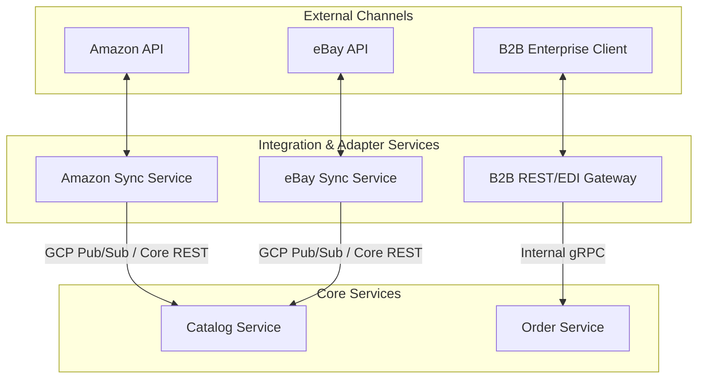

# ADR 0006: Decoupled Integration Adapters for B2B and Marketplaces

## Status
**Accepted**

## Context
The Abysalto Webshop is an omnichannel retail platform. In addition to the Next.js web shop and mobile apps, it must support:
1. **Third-Party Marketplace Integrations:** Synchronizing inventory, pricing, and orders with multiple external marketplaces (Amazon, eBay, regional marketplaces).
2. **B2B Partner Integrations:** Supporting wholesale ordering, bulk file uploads, customized contract pricing tiers, and legacy enterprise schemas (EDI/XML).

Each external channel operates on unique API protocols, rate limits, schema structures, and data standards. Directly embedding this external logic into core services (like `Catalog Service` or `Order Service`) would lead to a cluttered codebase, high risk of regression when third-party APIs change, and performance degradation.

## Decision
We decided to decouple B2B and Marketplace integrations from core backend services by deploying specialized **Adapter Microservices** that act as translation gateways and isolation layers.

### Key Architectural Guidelines
* **Schema Translation:** Integration adapters ingest legacy XML, EDI, or external JSON payloads and map them into the standardized, internal JSON schemas of the Abysalto Core platform.
* **Rate Limiting & Queueing:** External rate limits (e.g., Amazon SP-API throttling limits) are handled entirely within the adapter services using localized caching, queueing, and back-off retry logic, ensuring core services are never overwhelmed.
* **B2B Authorization:** B2B integration gateways enforce customized API keys, IP whitelisting, and strict client validation prior to routing traffic to internal services.

## Consequences

### Positive (Benefits)
* **Domain Cleanliness:** Core microservices (`Catalog`, `Order`, `Payment`) remain pure and only understand the webshop's own internal domain models, free from Amazon or EDI-specific logic.
* **High Extensibility:** Adding a new marketplace (e.g., Shopify, Walmart) is as simple as developing and deploying a new isolated adapter service, with zero downtime or deployments needed for core services.
* **Resilience:** If the Amazon SP-API experiences outages or returns errors, only the `Amazon Sync Service` is affected. Core consumer checkout operations proceed without interruption.

### Negative / Trade-offs
* **Increased Microservice Count:** Adding adapters increases the total number of microservices deployed on GKE, which slightly increases cluster configuration overhead.
* **Eventual Sync Delays:** Inventory and price sync to external marketplaces are asynchronous. A change in catalog inventory can take seconds to minutes to reflect on Amazon depending on external API rate limits.
