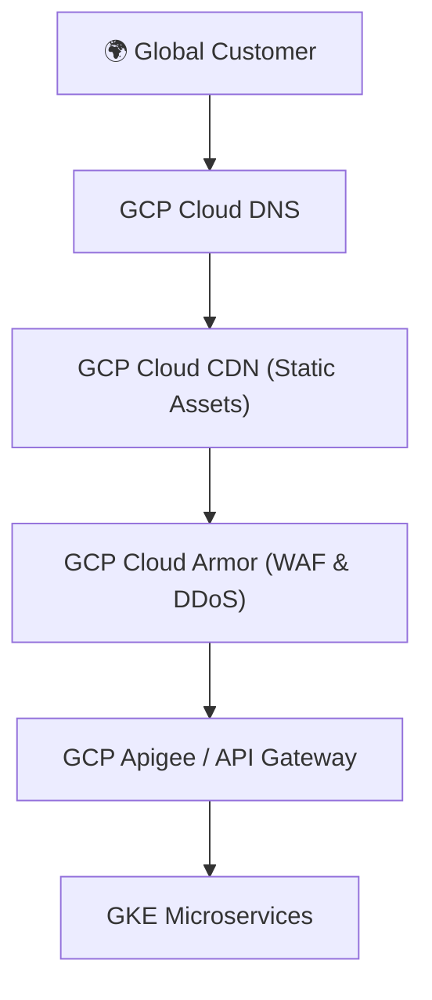

# ADR 0007: Layered Edge Security & Delivery Infrastructure

## Status
**Accepted**

## Context
Serving millions of active users globally means the Abysalto Webshop is a high-profile target for distributed denial-of-service (DDoS) attacks, brute-force hacking, SQL injections, scraping, and credit card fraud. 
Because the system processes payment transactions, we must strictly maintain **PCI-DSS Compliance**. We require an edge and delivery infrastructure that protects backend microservices on Google Kubernetes Engine (GKE) while delivering sub-second global responses.

## Decision
We decided to deploy a **Layered Edge Security and Delivery Infrastructure** using Google Cloud native network edges: **GCP Cloud DNS**, **GCP Cloud CDN**, **GCP Cloud Armor (WAF/DDoS)**, and **Apigee / Cloud API Gateway**.

### Key Security Layers
1. **DDoS Protection & WAF (GCP Cloud Armor):** Cloud Armor sits at the Google network edge, absorbing layer-3 and layer-4 DDoS attacks. It enforces OWASP Top 10 web application firewall (WAF) filtering to block SQL injection (SQLi) and cross-site scripting (XSS) before requests reach GKE.
2. **Global Acceleration (GCP Cloud CDN):** Caches static assets, media, and ISR pages close to global users, significantly decreasing latency while shifting heavy read loads off backend microservices.
3. **Enterprise API Management (Apigee / Cloud API Gateway):** Acts as the single entry point for API traffic. It handles rate limiting, TLS termination, API key verification, OAuth2 tokens, and analytics logging.

## Consequences

### Positive (Benefits)
* **PCI-DSS Compliance Readiness:** Layered edge security, TLS 1.3 enforcement, and Cloud Armor firewalls form the foundation of a PCI-DSS compliant architecture.
* **Backend Isolation:** Core microservices are locked within private GKE subnets. They cannot be accessed directly from the public internet, dramatically shrinking the system's attack surface.
* **Global Speed:** Static resources and edge-cached pages are served near instantly via GCP's high-speed global fiber-optic network.

### Negative / Trade-offs
* **Cache Invalidation Latency:** Changes to static content or ISR web shop pages can take time to propagate globally unless cache purges are triggered (integrated into the CI/CD pipeline, see ADR 0003).
* **Cost:** Enterprise-tier features in Cloud Armor and Apigee carry premium monthly costs on GCP. However, this is justified by the security guarantees and prevention of costly security breaches or outages.
