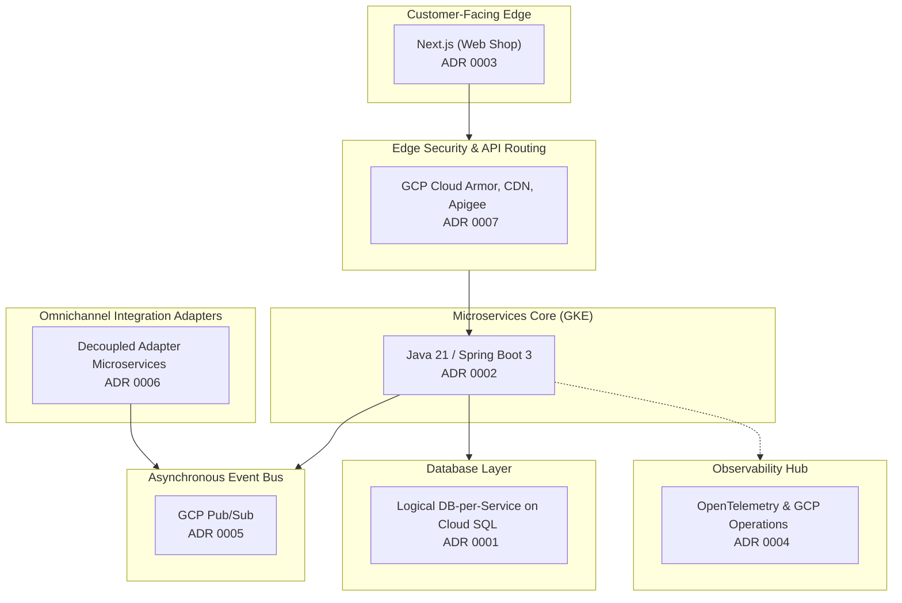

# Abysalto Webshop - Architecture Decision Records (ADR)

This directory serves as the centralized repository for all key architectural decisions made for the Abysalto Webshop retail platform. 

We utilize **Architecture Decision Records (ADRs)** to document our design choices, their context, rationales, and positive/negative trade-offs. This promotes transparency, keeps cross-functional teams aligned, and prevents architectural drift as the platform scales.

---

## 🗺️ Architectural Map

The following map connects our core architectural decisions to our system components:

---

## 🗂️ Active Architecture Decision Records (ADR) Registry

| Record ID | Architectural Decision Title | Status | Primary Component | Key Justification Summary |
| :--- | :--- | :---: | :--- | :--- |
| **[ADR 0001](0001-database-isolation-strategy.md)** | Logical Database-per-Service Isolation Strategy | **Accepted** | Database / Cloud SQL | Guarantees schema isolation across autonomous teams while saving costs compared to dedicated database instances. |
| **[ADR 0002](0002-backend-java-spring-boot.md)** | Backend Programming Language, Framework, and Codebase Structure | **Accepted** | Backend Microservices | Leverages Java 21 Virtual Threads and Spring Boot 3.x in a multi-module monorepo for maximum throughput and developer speed. |
| **[ADR 0003](0003-frontend-nextjs.md)** | Frontend Web Shop Framework | **Accepted** | Frontend / Next.js | Maximizes page speeds and SEO indexability using Incremental Static Regeneration (ISR) and Server-Side Rendering (SSR). |
| **[ADR 0004](0004-monitoring-and-observability.md)** | Monitoring & Observability Architecture | **Accepted** | Telemetry / Cloud Ops | Avoids vendor lock-in using OpenTelemetry with standard Micrometer, pushing logs, metrics, and traces natively to GCP Cloud Operations. |
| **[ADR 0005](0005-event-driven-architecture.md)** | Event-Driven Architecture with Google Cloud Pub/Sub | **Accepted** | Event Stream / Broker | Decouples services, processes operations asynchronously, and buffers heavy loads using serverless global Pub/Sub. |
| **[ADR 0006](0006-decoupled-integration-adapters.md)** | Decoupled Integration Adapters for B2B and Marketplaces | **Accepted** | Integrations / Adapters | Insulates core services from third-party API changes, throttling limits, and legacy schemas (XML/EDI/JSON). |
| **[ADR 0007](0007-layered-edge-security.md)** | Layered Edge Security & Delivery Infrastructure | **Accepted** | Security / Edge Networking | Establishes a PCI-DSS compliant, DDoS-protected, globally-accelerated network edge using GCP native Cloud Armor, CDN, and Apigee. |

---

## ⚖️ General Architectural Principles

All future architectural proposals and decisions must adhere to our core principles:
1. **Security-First Design:** Direct access to databases or internal microservices is blocked; all external traffic must cross API Gateway and Web Application Firewalls.
2. **Strict Domain Separation:** Microservices must never query another microservice's database. Keep schemas isolated.
3. **Decoupled Asynchrony:** Heavy workloads, downstream syncs, and notifications must be offloaded to asynchronous background execution via GCP Pub/Sub events.
4. **Zero-Trust Networking:** All endpoints default to closed, using service accounts, GCP IAM, and Kubernetes Network Policies to authenticate identities.
