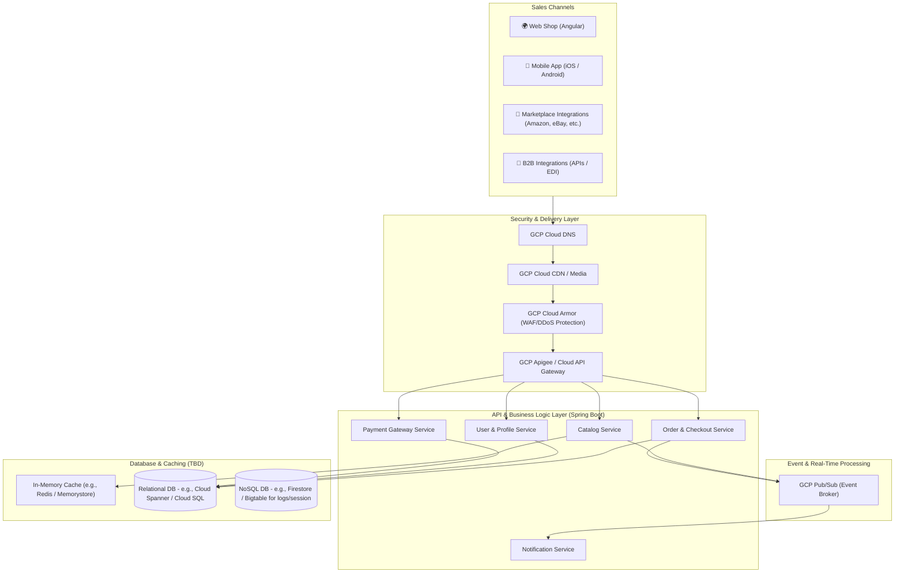

# Abysalto Webshop - High-Level Architecture Draft

This document outlines the first draft of the high-level system architecture for the Abysalto Webshop retail platform. The platform is designed to serve a global market with millions of active users daily, supporting multiple sales channels, real-time data processing, secure transactions, and extreme scalability.

> [!TIP]
> For detailed implementation strategies on handling extreme scale, secure transactions, and real-time processing pipelines, see the **[Technical Architecture Deep-Dive](deep_dive.md)**.

---

## 1. System Goals & Architecture Principles

*   **Scalability & High Availability:** Support millions of daily active users with low latency, using auto-scaling, caching, and a distributed cloud infrastructure on Google Cloud Platform (GCP).
*   **Omnichannel Support:** Provide consistent business logic across web, mobile, marketplace, and B2B channels.
*   **Secure Transactions:** Ensure PCI-DSS compliance, robust encryption in transit and at rest, and protection against malicious traffic.
*   **Real-Time Capabilities:** Process inventory changes, order updates, and search analytics in real time.
*   **Extensibility:** Decouple components using an event-driven design to allow cross-functional teams to work independently.

---

## 2. High-Level Architecture Diagram

---

## 3. Architecture Breakdown

### 3.1. Sales Channels (Frontend & Integrations)
To target a diverse customer base, the system supports four main entry points:
*   **Web Shop:** A modern, fast, and responsive Angular single-page application (SPA), optimized for SEO and global delivery via GCP Cloud CDN.
*   **Mobile Applications:** Native or hybrid mobile applications communicating with the same backend APIs.
*   **Marketplace Integrations:** Background integration workers that synchronize inventory, pricing, and orders with external marketplaces (e.g., Amazon, eBay).
*   **B2B Integrations:** Secure partner-facing REST APIs or EDI gateways enabling high-volume bulk ordering and contract pricing.

### 3.2. API & Business Logic Layer (Spring Boot 3.x)
*   **Technology:** Spring Boot 3.x (Java 21) organized as a **Multi-Module Monorepo** (Gradle/Maven multi-module setup) for unified dependency management and rapid cross-module refactoring.
*   **API Gateway & BFF:** 
    *   **GCP Apigee** handles edge security, rate limiting, and partner/B2B integrations (translating formats, managing client keys, mTLS).
    *   A **Backend-for-Frontend (BFF)** gateway patterns web/mobile requests, aggregating responses to minimize mobile network payload sizes.
*   **Service Design:** Highly modular, containerized Spring Boot backend services (e.g., Catalog, Order, User, Payment) deployed to GKE, enabling autonomous domain ownership for the two cross-functional teams.

### 3.3. Database & Caching Strategy
*The system implements a strict **Logical Database-per-Service** design to prevent database bottlenecks and team coupling while maintaining cost-effective cloud resource usage:*

1.  **Split-Read Catalog Tier (Redis + Elasticsearch):**
    *   **Elasticsearch (Elastic Cloud on GCP):** Powers the search bar, type-ahead/auto-complete, dynamic filtering (facets), and search relevance ranking.
    *   **GCP Memorystore for Redis:** Acts as a high-speed cache for individual Product Detail Page (PDP) requests (direct ID lookups), yielding sub-millisecond retrieval times.
2.  **Transactional Database Tier (Cloud Spanner):**
    *   **Logical DB-per-Service:** Each service (e.g., Order, Inventory) connects to its own isolated database schema on a shared **GCP Cloud Spanner** cluster. 
    *   **Zero Direct Cross-Service Queries:** The Order service never queries Catalog tables directly. Any inter-service data dependencies (e.g., order pricing checks) are handled via high-speed internal gRPC APIs.
3.  **NoSQL & Relational Tiers:**
    *   **Cloud SQL (PostgreSQL):** For isolated relational services like User & Profile data where standard SQL matches complex relationship structures.

### 3.4. Real-Time Processing & Event Streaming
*   **Event Broker (GCP Pub/Sub):** Asynchronous event-driven communication to decouple checkout processing from notifications, inventory updates, and analytical pipelines.
*   When an order is completed, the checkout service publishes an `OrderPlaced` event. Subscribed services (e.g., Inventory, Email/Notification, Shipping) process this event independently.
*   **Data Snapping:** During checkout, the Order Service captures and writes a permanent JSON **snapshot** of product prices and shipping details at that specific moment, removing any requirement to join against the Catalog database for historical order reporting.

---

## 4. Google Cloud Platform (GCP) Mapping

Below is the updated mapping of architectural components to native GCP services:

| Component | Proposed GCP Service | Rationale |
| :--- | :--- | :--- |
| **Hosting & Container Orchestration** | Google Kubernetes Engine (GKE) | Industry standard for scaling microservices, self-healing, and rolling updates. |
| **API Management & Edge** | Apigee + Cloud Armor | Secure, rate-limited public APIs; translates B2B requests; blocks DDoS and OWASP threats. |
| **Full-Text Catalog Search** | Elasticsearch (Elastic Cloud on GCP) | Fuzzy matching, category facets, and auto-complete for fast product discovery. |
| **Caching** | Cloud Memorystore for Redis | Fully managed Redis for sub-millisecond caching of hot data. |
| **Asynchronous Messaging** | Cloud Pub/Sub | Fully managed, global-scale real-time messaging middleware. |
| **Relational Database** | Cloud Spanner (Multi-Region) | Logical DB-per-service configuration providing global scalability with strong transactional consistency. |
| **Relational (Profile/User)** | Cloud SQL (PostgreSQL) | Isolated storage for relational profile and configuration data. |
| **Logging & Monitoring** | Cloud Logging & Cloud Monitoring (Operations Suite) | Centralized metrics, tracing, and log aggregation for quick issue resolution. |

---

## 5. Key Decisions & Next Steps

1.  **Codebase Bootstrap:** Initialize the Multi-Module Monorepo with Spring Boot 3.x and Java 21, establishing shared `core-common` packages for security and model mapping.
2.  **Database Strategy Alignment:** Adopt **Logical DB-per-Service on a shared Cloud Spanner instance**, implementing schema isolation per team domain.
3.  **Split-Read Implementation:** Design indexing pipelines to feed real-time catalog changes from Cloud Spanner to both Redis and Elasticsearch via GCP Pub/Sub.
4.  **CI/CD Pipeline Design:** Set up build and deployment pipelines (using GitHub Actions, Google Cloud Build, and Artifact Registry) targeting GKE.
