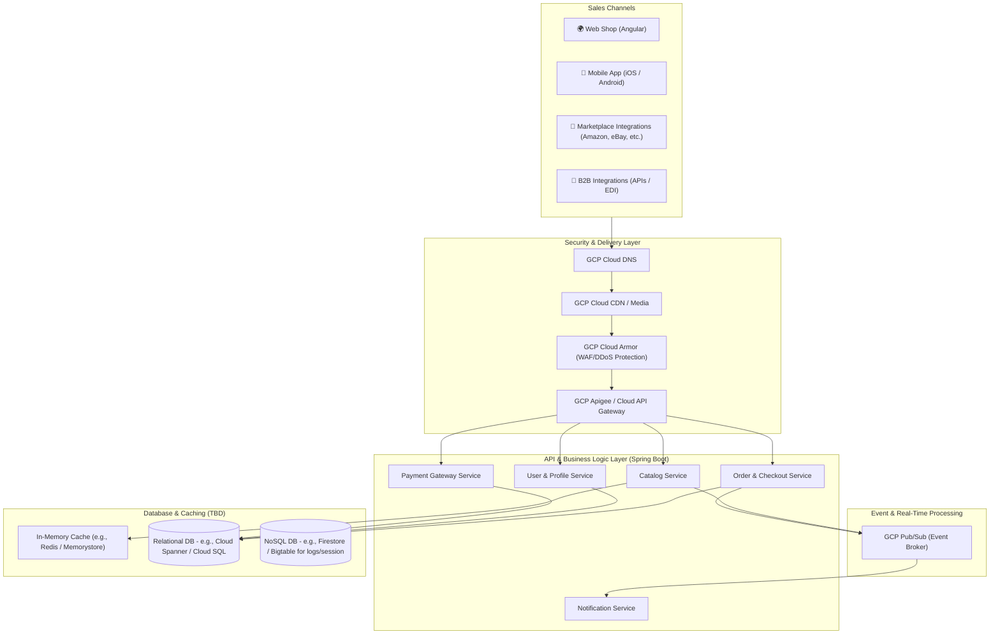

# Abysalto Webshop - High-Level Architecture Draft

This document outlines the first draft of the high-level system architecture for the Abysalto Webshop retail platform. The platform is designed to serve a global market with millions of active users daily, supporting multiple sales channels, real-time data processing, secure transactions, and extreme scalability.

---

## 1. System Goals & Architecture Principles

*   **Scalability & High Availability:** Support millions of daily active users with low latency, using auto-scaling, caching, and a distributed cloud infrastructure on Google Cloud Platform (GCP).
*   **Omnichannel Support:** Provide consistent business logic across web, mobile, marketplace, and B2B channels.
*   **Secure Transactions:** Ensure PCI-DSS compliance, robust encryption in transit and at rest, and protection against malicious traffic.
*   **Real-Time Capabilities:** Process inventory changes, order updates, and search analytics in real time.
*   **Extensibility:** Decouple components using an event-driven design to allow cross-functional teams to work independently.

---

## 2. High-Level Architecture Diagram

---

## 3. Architecture Breakdown

### 3.1. Sales Channels (Frontend & Integrations)
To target a diverse customer base, the system supports four main entry points:
*   **Web Shop:** A modern, fast, and responsive Angular single-page application (SPA), optimized for SEO and global delivery via GCP Cloud CDN.
*   **Mobile Applications:** Native or hybrid mobile applications communicating with the same backend APIs.
*   **Marketplace Integrations:** Background integration workers that synchronize inventory, pricing, and orders with external marketplaces (e.g., Amazon, eBay).
*   **B2B Integrations:** Secure partner-facing REST APIs or EDI gateways enabling high-volume bulk ordering and contract pricing.

### 3.2. API & Business Logic Layer (Spring Boot)
*   **Technology:** Spring Boot (Java/Kotlin) for building resilient, enterprise-grade REST APIs.
*   **API Gateway:** A unified gateway (such as GCP Apigee or Cloud API Gateway) to handle authentication, rate limiting, request routing, and telemetry.
*   **Service Design:** Highly modular backend services (e.g., Catalog, Order, User, Payment) deployed as containerized services, facilitating rapid, independent deployment by cross-functional teams.

### 3.3. Database & Caching Strategy
*While the specific database technologies are open for decision, the following tiers are planned:*
1.  **Read Cache Tier:** High-performance, in-memory caching (e.g., GCP Memorystore for Redis) to offload catalog reads and session state, ensuring sub-millisecond response times.
2.  **Transactional Database Tier:** A highly scalable relational database to handle orders, inventory balance, and user accounts. Candidates include:
    *   *GCP Cloud Spanner:* Highly recommended for global consistency, horizontal scalability, and high availability (99.999%).
    *   *GCP Cloud SQL (PostgreSQL/MySQL):* Suitable for a regional, standard relational setup.
3.  **NoSQL / Analytical Tier:** For user carts, activity logs, and real-time clickstream data (e.g., Cloud Firestore or Bigtable).

### 3.4. Real-Time Processing & Event Streaming
*   **Event Broker (GCP Pub/Sub):** Asynchronous event-driven communication to decouple checkout processing from notifications, inventory updates, and analytical pipelines.
*   When an order is completed, the checkout service publishes an `OrderPlaced` event. Subscribed services (e.g., Inventory, Email/Notification, Shipping) process this event independently.

---

## 4. Google Cloud Platform (GCP) Mapping

Below is the preliminary mapping of architectural components to native GCP services:

| Component | Proposed GCP Service | Rationale |
| :--- | :--- | :--- |
| **Hosting & Container Orchestration** | Google Kubernetes Engine (GKE) | Industry standard for scaling microservices, self-healing, and rolling updates. |
| **API Management** | Apigee or Cloud API Gateway | Robust traffic management, API security, and analytics. |
| **Content Delivery & Security** | Cloud DNS + Cloud Armor + Cloud CDN | Prevents DDoS attacks, secures endpoints, and caches static assets globally. |
| **Asynchronous Messaging** | Cloud Pub/Sub | Fully managed, global-scale real-time messaging middleware. |
| **Relational Database** | Cloud Spanner *or* Cloud SQL | Cloud Spanner provides horizontal scalability with strong global consistency. |
| **Caching** | Cloud Memorystore for Redis | Fully managed Redis for sub-millisecond caching of hot data. |
| **Logging & Monitoring** | Cloud Logging & Cloud Monitoring (Operations Suite) | Centralized metrics, tracing, and log aggregation for quick issue resolution. |

---

## 5. Key Decisions & Next Steps

1.  **Framework Validation:** Confirm the exact microservice strategy (Spring Boot version, Spring Cloud Gateway vs. Apigee).
2.  **Database Selection:** Perform a trade-off analysis between **Cloud Spanner** (higher cost, massive horizontal global scale) and **Cloud SQL** (lower cost, traditional relational architecture).
3.  **CI/CD Pipeline Design:** Set up build and deployment pipelines (using GitHub Actions, Google Cloud Build, and Artifact Registry) targeting GKE.
