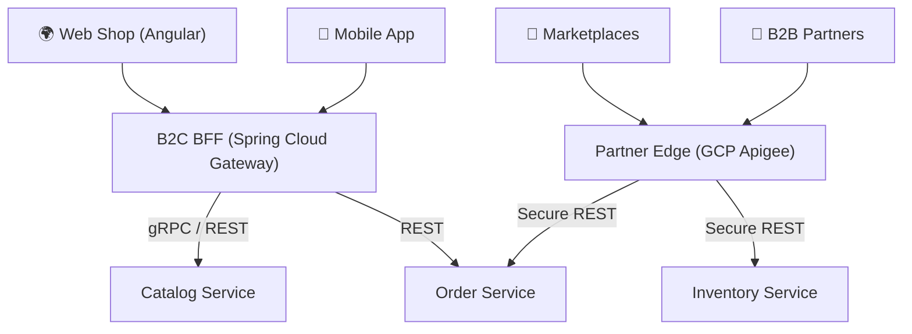

# Abysalto Webshop - High-Level Architecture Draft

This document outlines the first draft of the high-level system architecture for the Abysalto Webshop retail platform. The platform is designed to serve a global market with millions of active users daily, supporting multiple sales channels, real-time data processing, secure transactions, and extreme scalability.

> [!TIP]
> For detailed implementation strategies on handling extreme scale, secure transactions, and real-time processing pipelines, see the **[Technical Architecture Deep-Dive](deep_dive.md)**.

---

## 1. System Goals & Architecture Principles

*   **Scalability & High Availability:** Support millions of daily active users with low latency, using auto-scaling, caching, and a distributed cloud infrastructure on Google Cloud Platform (GCP).
*   **Omnichannel Support:** Provide consistent business logic across web, mobile, marketplace, and B2B channels.
*   **Secure Transactions:** Ensure PCI-DSS compliance, robust encryption in transit and at rest, and protection against malicious traffic.
*   **Real-Time Capabilities:** Process inventory changes, order updates, and search analytics in real time.
*   **Extensibility:** Decouple components using an event-driven design to allow cross-functional teams to work independently.

---

## 2. High-Level Architecture Diagram

```mermaid
graph TD
    %% Sales Channels
    subgraph Channels ["Sales Channels"]
        Web["🌍 Web Shop (Angular)"]
        Mobile["📱 Mobile App (iOS / Android)"]
        Marketplace["🛒 Marketplace Integrations (Amazon, eBay, etc.)"]
        B2B["🔗 B2B Integrations (APIs / EDI)"]
    end

    %% Edge & Security
    subgraph Edge ["Security & Delivery Layer"]
        DNS["GCP Cloud DNS"] --> CDN["GCP Cloud CDN / Media"]
        CDN --> Armor["GCP Cloud Armor (WAF/DDoS Protection)"]
        Armor --> APIGateway["GCP Apigee / Cloud API Gateway"]
    end

    Channels --> DNS

    %% API Layer (Spring Boot)
    subgraph APILayer ["API & Business Logic Layer (Spring Boot)"]
        direction TB
        CatalogSvc["Catalog Service"]
        OrderSvc["Order & Checkout Service"]
        UserSvc["User & Profile Service"]
        PaymentSvc["Payment Gateway Service"]
        NotificationSvc["Notification Service"]
    end

    APIGateway --> CatalogSvc
    APIGateway --> OrderSvc
    APIGateway --> UserSvc
    APIGateway --> PaymentSvc

    %% Message Broker & Real-Time Processing
    subgraph EventStream ["Event & Real-Time Processing"]
        PubSub["GCP Pub/Sub (Event Broker)"]
    end

    CatalogSvc --> PubSub
    OrderSvc --> PubSub
    PubSub --> NotificationSvc

    %% Database & Cache Layer
    subgraph StorageLayer ["Database & Caching (TBD)"]
        Cache["In-Memory Cache (e.g., Redis / Memorystore)"]
        PrimaryDB[(Relational DB - e.g., Cloud Spanner / Cloud SQL)]
        NoSQLDB[(NoSQL DB - e.g., Firestore / Bigtable for logs/session)]
    end

    CatalogSvc --> Cache
    OrderSvc --> PrimaryDB
    UserSvc --> PrimaryDB
    PaymentSvc --> PrimaryDB
```



---

## 3. Architecture Breakdown

### 3.1. Sales Channels (Frontend & Integrations)
To target a diverse customer base, the system supports four main entry points:
*   **Web Shop:** A modern, fast, and responsive Angular single-page application (SPA), optimized for SEO and global delivery via GCP Cloud CDN.
*   **Mobile Applications:** Native or hybrid mobile applications communicating with the same backend APIs.
*   **Marketplace Integrations:** Background integration workers that synchronize inventory, pricing, and orders with external marketplaces (e.g., Amazon, eBay).
*   **B2B Integrations:** Secure partner-facing REST APIs or EDI gateways enabling high-volume bulk ordering and contract pricing.

### 3.2. API & Business Logic Layer (Spring Boot 3.x)

The backend business logic is built on **Spring Boot 3.x** and **Java 21**, structured as a **Multi-Module Monorepo** and deployed as independent microservices to Google Kubernetes Engine (GKE).

#### 3.2.1. Codebase Structure: Multi-Module Monorepo
A single Git repository is split into distinct Maven/Gradle modules. This keeps development fast, simplifies common dependencies, and supports clean separation of concerns.

```text
abysalto-webshop/
├── .github/workflows/         # CI/CD pipelines (targeted module builds)
├── build.gradle               # Root build file managing global library versions
├── settings.gradle            # Registers all sub-modules
│
├── core-common/               # Shared non-business module
│   ├── src/main/java/com/abysalto/core/
│   │   ├── security/          # JWT validation filters, CORS configuration
│   │   ├── exception/         # Global API error handlers, RFC-7807 formats
│   │   └── dto/               # Shared general payloads (e.g., Address, Money)
│   └── build.gradle
│
├── catalog-service/           # Catalog & inventory queries (Team A)
│   ├── src/main/java/com/abysalto/catalog/
│   ├── Dockerfile
│   └── build.gradle
│
├── order-service/             # Checkout & checkout state (Team B)
│   ├── src/main/java/com/abysalto/order/
│   ├── Dockerfile
│   └── build.gradle
│
└── payment-service/           # High-security gateway wrapper (Team B)
    ├── src/main/java/com/abysalto/payment/
    ├── Dockerfile
    └── build.gradle
```

##### Module Responsibilities & Build Pipeline
*   **Root Dependency Management:** The root `build.gradle` defines standard dependency versions (e.g., Spring Boot 3.x, Spring Cloud, MapStruct, Lombok) to guarantee version consistency across all teams.
*   **The `core-common` Module:** Houses boilerplate logic (logging, tracing, security, errors). It is imported as a library by local microservices (e.g., `implementation project(':core-common')`). It **never** contains business domain objects to prevent coupling.
*   **Targeted CI/CD Builds:** To avoid building the entire monorepo on every commit, the GitHub Actions or Google Cloud Build pipeline utilizes path filters (e.g., `paths: ['catalog-service/**']`). If a change only occurs inside the catalog service, only its Docker image is built and deployed to GKE.

#### 3.2.2. API Gateway & Routing Strategy
To securely expose backend domains to different sales channels, the API layer is split into a **B2C Edge** and a **B2B/Partner Edge**.



##### 1. B2C Edge: Backend-for-Frontend (BFF) Gateway
*   **Technology:** Spring Cloud Gateway (built on Spring WebFlux for reactive, non-blocking performance) or a GraphQL Gateway.
*   **Aggregation:** Minimizes mobile network payloads by aggregating calls. A single request to `GET /home` on the mobile app is translated by the BFF into parallel backend calls to `Catalog Service` and `User Service`, stitching the result into one response.
*   **Client Session Validation:** Inspects and validates JWTs emitted by the identity provider, inserting authenticated headers (e.g., `X-User-Id`, `X-User-Roles`) before routing requests downstream.

##### 2. Partner Edge: GCP Apigee Gateway
*   **mTLS and API Keys:** Secures server-to-server B2B integrations requiring mutual TLS (mTLS) or custom API Keys.
*   **Transformation & Translation:** Translates legacy partner protocols (e.g., XML or SOAP) into clean JSON payloads consumed by our modern Spring Boot RestControllers.
*   **Monetization & Quota Management:** Controls partner usage tiers, automatically throttling clients that exceed contracted requests/minute.

##### 3. Inter-Service Communication (Internal Network)
*   **gRPC with Protobuf:** For high-speed, low-overhead internal communication (e.g., when the `Order Service` checks product price and stock availability in the `Catalog Service`). This results in network response times under 2ms.
*   **REST with HTTP/2:** Used as a fallback for simple, standard synchronous messaging between GKE pods.
*   **mTLS Mesh:** Internal GKE communication is secured using an Istio service mesh, encrypting internal pod-to-pod traffic automatically.

### 3.3. Database & Caching Strategy
*The system implements a strict **Logical Database-per-Service on a shared Cloud Spanner instance** design to prevent database bottlenecks and team coupling while maintaining cost-effective cloud resource usage. For full topology schemas, hotspot mitigations, interleaving parent-child tables, and DDL examples, see the detailed **[Cloud Spanner Database Strategy](database_strategy.md)**.*

1.  **Split-Read Catalog Tier (Redis + Elasticsearch):**
    *   **Elasticsearch (Elastic Cloud on GCP):** Powers the search bar, type-ahead/auto-complete, dynamic filtering (facets), and search relevance ranking.
    *   **GCP Memorystore for Redis:** Acts as a high-speed cache for individual Product Detail Page (PDP) requests (direct ID lookups), yielding sub-millisecond retrieval times.
2.  **Transactional Database Tier (Cloud Spanner):**
    *   **Logical DB-per-Service on Shared Spanner:** Each team's service (e.g., Catalog, Order, Payment) is provisioned with its own logical database (e.g., `catalog_db`, `order_db`) on a shared **GCP Cloud Spanner** cluster instance.
    *   **Zero Direct Cross-Service Queries:** Services are strictly forbidden from querying another service's tables directly. Any inter-service data dependencies (e.g., checkout price validation) are performed via high-speed internal gRPC APIs.
3.  **NoSQL & Relational Tiers:**
    *   **Cloud SQL (PostgreSQL):** For isolated relational services like User & Profile data where standard SQL matches complex relationship structures.

### 3.4. Real-Time Processing & Event Streaming
*   **Event Broker (GCP Pub/Sub):** Asynchronous event-driven communication to decouple checkout processing from notifications, inventory updates, and analytical pipelines.
*   When an order is completed, the checkout service publishes an `OrderPlaced` event. Subscribed services (e.g., Inventory, Email/Notification, Shipping) process this event independently.
*   **Data Snapping:** During checkout, the Order Service captures and writes a permanent JSON **snapshot** of product prices and shipping details at that specific moment, removing any requirement to join against the Catalog database for historical order reporting.

---

## 4. Google Cloud Platform (GCP) Mapping

Below is the updated mapping of architectural components to native GCP services:

| Component | Proposed GCP Service | Rationale |
| :--- | :--- | :--- |
| **Hosting & Container Orchestration** | Google Kubernetes Engine (GKE) | Industry standard for scaling microservices, self-healing, and rolling updates. |
| **API Management & Edge** | Apigee + Cloud Armor | Secure, rate-limited public APIs; translates B2B requests; blocks DDoS and OWASP threats. |
| **Full-Text Catalog Search** | Elasticsearch (Elastic Cloud on GCP) | Fuzzy matching, category facets, and auto-complete for fast product discovery. |
| **Caching** | Cloud Memorystore for Redis | Fully managed Redis for sub-millisecond caching of hot data. |
| **Asynchronous Messaging** | Cloud Pub/Sub | Fully managed, global-scale real-time messaging middleware. |
| **Relational Database** | Cloud Spanner (Multi-Region) | Logical DB-per-service configuration providing global scalability with strong transactional consistency. |
| **Relational (Profile/User)** | Cloud SQL (PostgreSQL) | Isolated storage for relational profile and configuration data. |
| **Logging & Monitoring** | Cloud Logging & Cloud Monitoring (Operations Suite) | Centralized metrics, tracing, and log aggregation for quick issue resolution. |

---

## 5. Key Decisions & Next Steps

1.  **Codebase Bootstrap:** Initialize the Multi-Module Monorepo with Spring Boot 3.x and Java 21, establishing shared `core-common` packages for security and model mapping.
2.  **Database Strategy Alignment:** Adopt **Logical DB-per-Service on a shared Cloud Spanner instance**, implementing schema isolation per team domain. Detailed specifications, IAM topologies, DDL schemas, and migration patterns are established in the **[Cloud Spanner Database Strategy](database_strategy.md)**.
3.  **Split-Read Implementation:** Design indexing pipelines to feed real-time catalog changes from Cloud Spanner to both Redis and Elasticsearch via GCP Pub/Sub.
4.  **CI/CD Pipeline Design:** Set up build and deployment pipelines (using GitHub Actions, Google Cloud Build, and Artifact Registry) targeting GKE.
