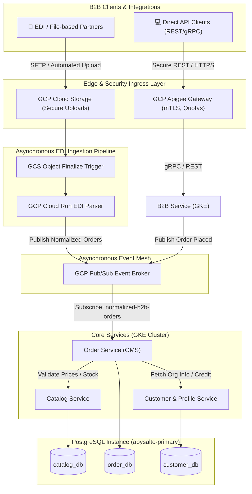
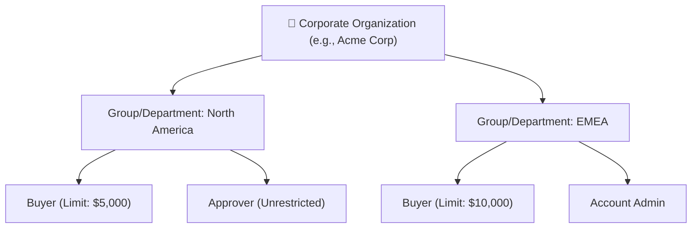
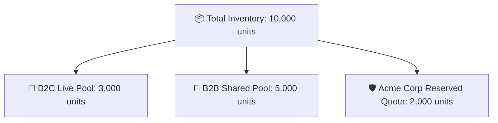
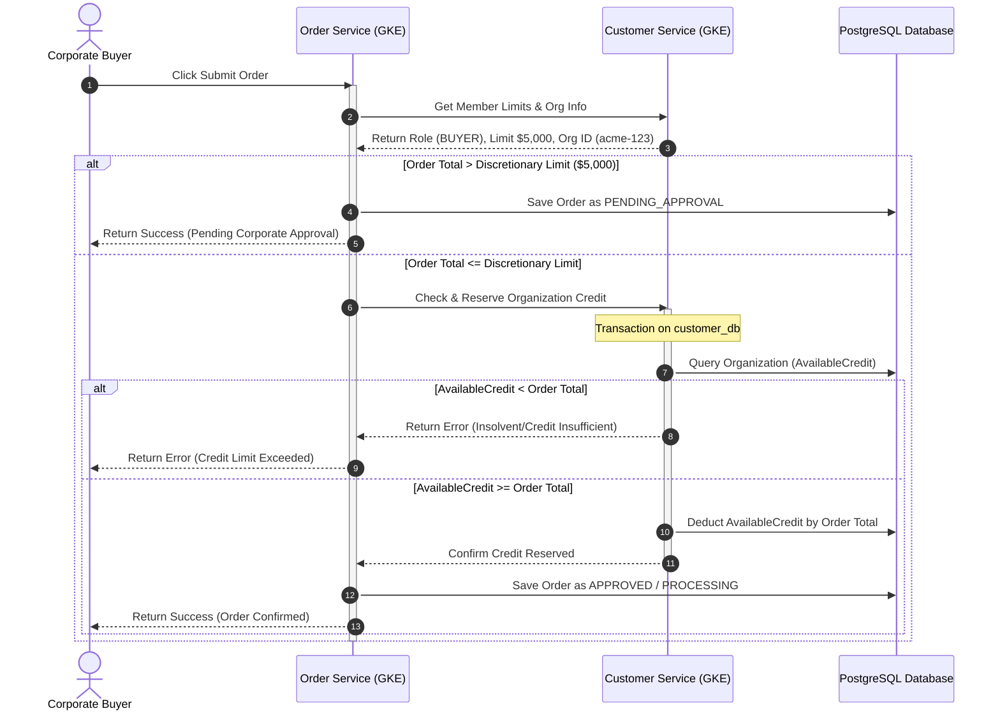

# Abysalto Webshop - B2B Integration Architecture

This document specifies the technical design, architectural patterns, data schemas, and operational logic required to integrate and support global B2B partners, corporate clients, and high-volume wholesale ordering on the Abysalto Webshop platform.

---

## 1. Architectural Strategy: Secure Partner Edge & EDI Ingestion

B2B integrations must support standard enterprise REST/gRPC APIs alongside traditional electronic data interchange (EDI) and file-based pipelines (e.g., CSV, XML). To maintain system stability and separate high-volume automated traffic from standard retail traffic, the B2B channel leverages a dual-path ingress strategy.



### 1.1. Synchronous API Pathway (GCP Apigee)
*   **Mutual TLS (mTLS):** Enforces cryptographic proof of partner identity before any payload reaches the GKE cluster.
*   **IP Whitelisting & CIDR Pinning:** Limits connections to authorized partner data centers.
*   **Quota and Rate Control:** Implements separate quota pools per organization to protect core e-commerce services from denial-of-service style polling loops.

### 1.2. Asynchronous EDI & File Ingestion Pipeline
To support legacy enterprise partners who submit bulk purchase orders via daily XML, CSV, or EDIFACT/X12 files:
1.  **Secure Upload:** Partners or scheduled batch scripts drop files into a designated bucket in **GCP Cloud Storage** via SFTP Gateway or secure signed URLs.
2.  **Event-Driven Trigger:** GCS emits an `Object:Finalized` event to **Cloud Run** via Eventarc.
3.  **Cloud Run Parser:** A stateless, auto-scaling Cloud Run parser reads the uploaded file, maps legacy supplier/partner schemas to the normalized JSON B2B Order schema, and publishes the normalized payload to the GCP Pub/Sub topic `b2b-orders-normalized`.
4.  **OMS Consumption:** The `order-service` consumes the normalized orders and processes them asynchronously, isolating heavy bulk ingestion from live customer-facing transactional threads.

---

## 2. Enterprise Account Hierarchy Model

Unlike B2C customers, B2B buyers operate within complex corporate hierarchies. The system maps these structures to enforce organizational control, budgets, and approval workflows.



### 2.1. Member Roles & Rules:
*   **Account Administrator (ADMIN):** Manages departments, assigns roles, updates default payment and shipping methods, and views the complete organizational history.
*   **Approver (APPROVER):** Authorizes orders placed by Buyers that exceed individual discretionary spending thresholds.
*   **Buyer (BUYER):** Browses custom catalogs, builds carts, and initiates checkouts. If a checkout total exceeds the Buyer's spending limit, the checkout state transitions to `PENDING_APPROVAL` and triggers a notification to organization Approvers.

---

## 3. Contract Pricing & Custom Assortments Engine

B2B partnerships require highly customized commercial terms, including negotiated contract pricing, tiered volumetric discounts, and restricted product visibility.

```text
Price Evaluation Pipeline Order:
[ SKU Requested ] 
       │
       ▼
[ Step 1: Active Contract Price? ] ──────► Yes ──► Apply Contract Price (Stop)
       │ No
       ▼
[ Step 2: Volume/Tiered Discount? ] ─────► Yes ──► Apply Tiered Price (Stop)
       │ No
       ▼
[ Step 3: Base MSRP/Retail Price ] ────────────────► Apply Base Catalog Price
```

### 3.1. Rules & Priority Calculation:
1.  **Contract Pricing:** Negotiated prices defined in a valid contract always override retail prices.
2.  **Volumetric Tier Pricing:** If a contract specifies tiered pricing for a SKU, the unit price scales downward as the order quantity increases:
    \[
    P(\text{qty}) = \begin{cases} 
    P_{\text{base}} & \text{if } \text{qty} < 100 \\
    P_{\text{tier 1}} & \text{if } 100 \le \text{qty} < 500 \\
    P_{\text{tier 2}} & \text{if } \text{qty} \ge 500 
    \end{cases}
    \]
3.  **Restricted Custom Assortments:** Catalog queries evaluate `ContractAssortments` mapping tables. If an organization is restricted to a curated assortment, search indices (Elasticsearch) and direct product queries automatically filter out non-contracted SKUs.

### 3.2. Performance Optimization via Redis Caching
Evaluating contract rules and hierarchies at high volumes can become database-intensive. 
*   Custom B2B contract sheets and catalog filters are cached inside **GCP Memorystore for Redis** using an organization-keyed hash (e.g., `b2b:org:acme-123:prices`).
*   Cache invalidation is triggered event-driven via **PostgreSQL Database Triggers** or application event publishers whenever contract records are updated in `catalog_db`.

---

## 4. Inventory Allocation & Quota Management

B2B clients purchase in massive quantities. To prevent a single enterprise bulk purchase from instantly depleting consumer inventory (and spoiling B2C storefront experiences), the platform implements an **Inventory Partitioning and Quota Model**.



### 4.1. Rules:
*   **Pool Partitioning:** Physical stock levels are divided into logical B2C, B2B Shared, and Client-Specific reserved quotas.
*   **Automatic Release:** Client-specific reserved quotas are bound to contract agreements. If reserved B2B stock is not purchased by a specified contract expiration date, the remaining units are automatically merged back into the B2B Shared or B2C Live pools.

---

## 5. Transactional Database Schema Extensions (PostgreSQL)

Adhering to our logical DB-per-service paradigm, we extend the Google Cloud SQL for PostgreSQL schemas. All primary keys utilize random native `UUID` values to eliminate any database hotspotting.

### 5.1. Customer Service Database (`customer_db`)

```sql
-- Represents a B2B corporate customer account
CREATE TABLE Organizations (
    OrganizationId UUID PRIMARY KEY DEFAULT uuid_generate_v4(),
    Name VARCHAR(255) NOT NULL,
    CreditLimit NUMERIC(12, 4) NOT NULL,
    AvailableCredit NUMERIC(12, 4) NOT NULL,
    PaymentTerms VARCHAR(50) NOT NULL, -- e.g., NET_30, NET_60, DUE_ON_RECEIPT
    IsActive BOOLEAN NOT NULL DEFAULT TRUE,
    CreatedAt TIMESTAMP WITH TIME ZONE DEFAULT CURRENT_TIMESTAMP NOT NULL,
    UpdatedAt TIMESTAMP WITH TIME ZONE DEFAULT CURRENT_TIMESTAMP NOT NULL
);

-- Departments or sub-entities within a B2B corporate customer
CREATE TABLE OrganizationDepartments (
    DepartmentId UUID PRIMARY KEY DEFAULT uuid_generate_v4(),
    OrganizationId UUID NOT NULL REFERENCES Organizations(OrganizationId) ON DELETE CASCADE,
    Name VARCHAR(255) NOT NULL,
    CreatedAt TIMESTAMP WITH TIME ZONE DEFAULT CURRENT_TIMESTAMP NOT NULL
);

-- Associates individual B2C Customer Profiles to an Organization with specific roles
CREATE TABLE OrganizationMembers (
    OrganizationId UUID NOT NULL REFERENCES Organizations(OrganizationId) ON DELETE CASCADE,
    CustomerId UUID NOT NULL, -- References CustomerId from B2C profile
    DepartmentId UUID REFERENCES OrganizationDepartments(DepartmentId) ON DELETE SET NULL,
    Role VARCHAR(50) NOT NULL, -- e.g., BUYER, APPROVER, ADMIN
    DiscretionaryLimit NUMERIC(12, 4), -- Purchase limit without requiring approval
    IsActive BOOLEAN NOT NULL DEFAULT TRUE,
    JoinedAt TIMESTAMP WITH TIME ZONE DEFAULT CURRENT_TIMESTAMP NOT NULL,
    PRIMARY KEY (OrganizationId, CustomerId)
);
```

### 5.2. Catalog Service Database (`catalog_db`)

```sql
-- B2B Contract agreements binding organizations to custom commercials
CREATE TABLE Contracts (
    ContractId UUID PRIMARY KEY DEFAULT uuid_generate_v4(),
    OrganizationId UUID NOT NULL, -- Logical link to Organizations table
    StartDate TIMESTAMP WITH TIME ZONE NOT NULL,
    EndDate TIMESTAMP WITH TIME ZONE NOT NULL,
    IsActive BOOLEAN NOT NULL DEFAULT TRUE,
    CreatedAt TIMESTAMP WITH TIME ZONE DEFAULT CURRENT_TIMESTAMP NOT NULL
);

-- Negotiated custom pricing and volume tiers for specific SKUs
CREATE TABLE ContractItems (
    ContractItemId UUID PRIMARY KEY DEFAULT uuid_generate_v4(),
    ContractId UUID NOT NULL REFERENCES Contracts(ContractId) ON DELETE CASCADE,
    SkuCode VARCHAR(50) NOT NULL, -- References Sku Code in Catalog
    BaseContractPrice NUMERIC(12, 4) NOT NULL,
    Tier1MinQty INT,
    Tier1Price NUMERIC(12, 4),
    Tier2MinQty INT,
    Tier2Price NUMERIC(12, 4),
    CreatedAt TIMESTAMP WITH TIME ZONE DEFAULT CURRENT_TIMESTAMP NOT NULL,
    UpdatedAt TIMESTAMP WITH TIME ZONE DEFAULT CURRENT_TIMESTAMP NOT NULL,
    UNIQUE (ContractId, SkuCode)
);

-- Restricts catalog visibility to specific SKUs for an Organization
CREATE TABLE ContractAssortments (
    OrganizationId UUID NOT NULL,
    SkuCode VARCHAR(50) NOT NULL,
    IsAllowed BOOLEAN NOT NULL DEFAULT TRUE,
    CreatedAt TIMESTAMP WITH TIME ZONE DEFAULT CURRENT_TIMESTAMP NOT NULL,
    PRIMARY KEY (OrganizationId, SkuCode)
);
```

### 5.3. Order Service Database (`order_db`)

```sql
-- Extends standard order schema with corporate and approval attributes
CREATE TABLE B2BOrderExtensions (
    OrderId UUID PRIMARY KEY,
    OrganizationId UUID NOT NULL,
    PurchaseOrderNumber VARCHAR(100),
    PaymentTerms VARCHAR(50) NOT NULL,
    ApprovalStatus VARCHAR(50) NOT NULL, -- e.g., APPROVED, PENDING_APPROVAL, REJECTED
    ApproverCustomerId UUID,
    ApprovalNotes VARCHAR(1000),
    ApprovedAt TIMESTAMP WITH TIME ZONE
);
```

---

## 6. Credit Protection & Checkout Workflows

Since B2B orders often rely on credit (Net-30/60 billing terms), the platform enforces strict, real-time credit-check loops inside checkout transactions to prevent bad debt exposure.



### 6.1. Handling Large Payload Processing
Bulk B2B orders may contain thousands of line items. Standard REST threads are restricted to a maximum size of **$10\text{MB}$** and a **$30\text{s}$ timeout** to maintain gateway performance. 
*   Orders with **$>200$ line items** must be submitted via the **Asynchronous Bulk API** endpoint (`POST /api/v1/b2b/orders/bulk`). 
*   This endpoint returns a `202 Accepted` status along with a unique `JobId` task tracker, delegating actual validation and inventory reservation processes to a background worker queue in GKE.

---

## 7. Next Steps & Implementation Pipeline
1.  **GCP Apigee Policy Setup:** Configure the Partner Edge policies on Apigee to implement mTLS and partner-based quota profiles.
2.  **DDL Deployment:** Apply the PostgreSQL DDL schema updates for `customer_db`, `catalog_db`, and `order_db` in the development environments.
3.  **B2B Service Bootstrapping:** Initialize the `b2b-service` module in our Spring Boot monorepo to house custom enterprise workflows.
