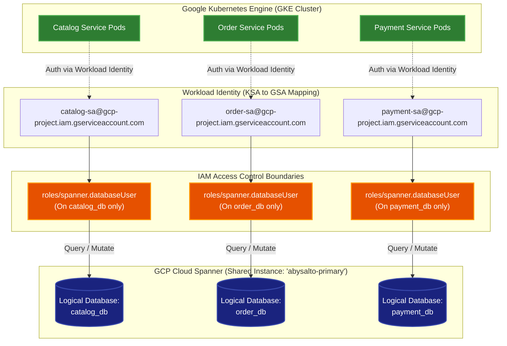
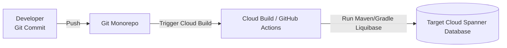

# Abysalto Webshop - Cloud Spanner Database Strategy

This document specifies the technical implementation details for the **Logical DB-per-Service on a shared Cloud Spanner instance** strategy. This approach balances strict database and schema isolation per team domain with cost-optimized cloud resource utilization.

---

## 1. Schema Isolation Topology

The system uses a single, shared, multi-region Google Cloud Spanner instance. Within this instance, separate, isolated logical databases are created for each microservice. This guarantees schema independence and domain boundaries while sharing the provisioned node compute capacity.



### Key Security & Isolation Features:
*   **Zero Direct Cross-Database Queries:** Microservices can only authenticate to their designated logical database. If `Order Service` needs catalog data, it must call the `Catalog Service` via high-speed internal gRPC APIs. Direct SQL joins across databases are physically blocked by Cloud Spanner's IAM engine.
*   **Workload Identity Integration:** Kubernetes Service Accounts (KSAs) are bound to Google Service Accounts (GSAs). No database passwords, tokens, or credential rotation are required in the microservice application properties.
*   **Shared Compute, Isolated Storage:** CPU and memory resources are shared across all schemas to maximize ROI, while transactional boundaries, schemas, and backups are isolated at the database level.

---

## 2. Team Domain Mapping

To support autonomous, cross-functional development, databases and schemas are partitioned by team domain ownership.

| Team | Service Domain | Logical Database | Primary Tables | Responsibility |
| :--- | :--- | :--- | :--- | :--- |
| **Team A** | Product Catalog | `catalog_db` | `Categories`, `Products`, `Skus`, `ProductAttributes` | Catalog search, product metadata, category taxonomies, and basic read-only stock caching. |
| **Team B** | Orders & Checkout | `order_db` | `Orders`, `OrderItems`, `OrderStateHistory` | Shopping cart conversion, order state machine, checkout, tax/shipping snapshots. |
| **Team B** | Payments | `payment_db` | `PaymentTransactions`, `Refunds` | Vaulted payment token references, high-security transaction logs, external payment gateway handshakes. |

---

## 3. Cloud Spanner Schema Engineering Best Practices

To leverage Cloud Spanner's distributed architecture without experiencing bottlenecks or hotspotting, schemas must follow these specific engineering patterns:

### 3.1. Hotspot Prevention
Cloud Spanner stores data in sorted order by primary key. If primary keys are sequential (e.g., auto-incrementing integers, timestamps, or sequential IDs), Spanner will write all new inserts to a single database split (the same physical node). This creates a write hotspot and severely limits write scalability.

*   **Primary Key Mandate:** All primary keys must be cryptographically random and non-sequential. We mandate the use of **UUID v4 (stored as `STRING(36)`)** or **cryptographically strong random hashes**.
*   **Anti-Pattern:** Never use sequential `INT64` auto-increment numbers, or timestamps as the first column in a primary key.
*   **Exception (Timestamp Prefixing):** If a timestamp must be part of the primary key, it must be preceded by a shard ID (e.g., a hashed value) or a random UUID string.

### 3.2. Table Interleaving (Parent-Child Co-location)
Table interleaving is a powerful feature in Cloud Spanner that co-locates rows of a child table with their parent row in physical storage splits. This ensures that parent and child rows are stored on the same physical server, enabling high-performance, single-shard transactions and eliminating network hops during joins.

*   **Design Pattern:** Interleave child tables that are strictly owned by and queried with a parent table.
    *   *Example:* `OrderItems` interleaved in `Orders`.
    *   *Example:* `Skus` interleaved in `Products`.
*   **Result:** When an order is fetched or created, Spanner updates or reads both the parent `Orders` row and all child `OrderItems` rows atomically on the same physical partition.

```mermaid
classDef table fill:#2a364f,stroke:#4f6080,stroke-width:2px,color:#fff;
classDef parent fill:#1e3d59,stroke:#17b978,stroke-width:2px,color:#fff;

subgraph StorageSplit ["Physical Storage Split / Node"]
    direction TB
    P["Order: UUID_A"]:::parent
    C1["OrderItem: UUID_A #1"]:::table
    C2["OrderItem: UUID_A #2"]:::table
    
    P -.->|Interleaved & Co-located| C1
    P -.->|Interleaved & Co-located| C2
end
```

### 3.3. Indexing & Storing Clauses
To perform fast searches without causing full-table scans, secondary indexes must be defined.
*   **Storing Clause:** When creating a secondary index, use the `STORING` clause to include commonly queried columns. This duplicates specified data inside the index table, allowing Spanner to satisfy the query entirely from the index without performing an expensive lookup join back to the primary table.
    *   *Example:* indexing orders by `CustomerId` and `STORING (Status, TotalAmount)`.

---

## 4. Production-Grade Spanner DDL Examples

### 4.1. Catalog Service Domain Schema (`catalog_db`)
This schema showcases parent-child table interleaving between `Products` and `Skus` and secondary indexing with the `STORING` clause.

```sql
-- DDL for catalog_db

CREATE TABLE Categories (
    CategoryId STRING(36) NOT NULL,
    Name STRING(100) NOT NULL,
    Slug STRING(120) NOT NULL,
    ParentCategoryId STRING(36),
    CreatedAt TIMESTAMP NOT NULL OPTIONS (allow_commit_timestamp=true),
    UpdatedAt TIMESTAMP NOT NULL OPTIONS (allow_commit_timestamp=true)
) PRIMARY KEY (CategoryId);

CREATE UNIQUE INDEX idx_categories_slug ON Categories(Slug);

CREATE TABLE Products (
    ProductId STRING(36) NOT NULL,
    CategoryId STRING(36) NOT NULL,
    Name STRING(255) NOT NULL,
    Description STRING(MAX),
    Status STRING(50) NOT NULL, -- ACTIVE, DRAFT, ARCHIVED
    CreatedAt TIMESTAMP NOT NULL OPTIONS (allow_commit_timestamp=true),
    UpdatedAt TIMESTAMP NOT NULL OPTIONS (allow_commit_timestamp=true)
) PRIMARY KEY (ProductId);

-- Secondary Index to lookup products by Category with STORING for fast catalog listing queries
CREATE INDEX idx_products_category ON Products(CategoryId) STORING (Name, Status);

CREATE TABLE Skus (
    ProductId STRING(36) NOT NULL,
    SkuId STRING(36) NOT NULL,
    SkuCode STRING(100) NOT NULL,
    PriceNumeric NUMERIC NOT NULL,
    PriceCurrency STRING(3) NOT NULL,
    StockQuantity INT64 NOT NULL,
    CreatedAt TIMESTAMP NOT NULL OPTIONS (allow_commit_timestamp=true),
    UpdatedAt TIMESTAMP NOT NULL OPTIONS (allow_commit_timestamp=true)
) PRIMARY KEY (ProductId, SkuId),
  INTERLEAVE IN PARENT Products ON DELETE CASCADE;

CREATE UNIQUE INDEX idx_skus_code ON Skus(SkuCode);
```

### 4.2. Order Service Domain Schema (`order_db`)
This schema showcases parent-child interleaving between `Orders` and `OrderItems` as well as indexing by `CustomerId` for customer dashboards.

```sql
-- DDL for order_db

CREATE TABLE Orders (
    OrderId STRING(36) NOT NULL,
    CustomerId STRING(36) NOT NULL,
    Status STRING(50) NOT NULL, -- CREATED, PAID, SHIPPED, COMPLETED, CANCELLED
    TotalAmount NUMERIC NOT NULL,
    Currency STRING(3) NOT NULL,
    CreatedAt TIMESTAMP NOT NULL OPTIONS (allow_commit_timestamp=true),
    UpdatedAt TIMESTAMP NOT NULL OPTIONS (allow_commit_timestamp=true)
) PRIMARY KEY (OrderId);

-- Secondary Index for customer order history queries
CREATE INDEX idx_orders_customer ON Orders(CustomerId) STORING (Status, TotalAmount, CreatedAt);

CREATE TABLE OrderItems (
    OrderId STRING(36) NOT NULL,
    OrderItemId STRING(36) NOT NULL,
    ProductId STRING(36) NOT NULL,
    SkuId STRING(36) NOT NULL,
    Quantity INT64 NOT NULL,
    UnitPrice NUMERIC NOT NULL,
    SnapshotProductName STRING(255) NOT NULL, -- Snapped product name to avoid cross-domain lookup
    CreatedAt TIMESTAMP NOT NULL OPTIONS (allow_commit_timestamp=true)
) PRIMARY KEY (OrderId, OrderItemId),
  INTERLEAVE IN PARENT Orders ON DELETE CASCADE;
```

---

## 5. Schema Migration Strategy (Liquibase)

To manage database updates safely across multiple environments without manual intervention, we use **Liquibase** with the native **Cloud Spanner Liquibase Extension**.



### 5.1. Core Principles of Schema Migrations
1.  **Independent Migration Repositories:** Each microservice module contains its own `db/changelog/` directory containing database-specific changelog files.
2.  **No DDL Lockouts:** Cloud Spanner supports online schema updates. Altering tables, adding columns, or creating indexes does not lock the database for read or write transactions.
3.  **Liquibase Execution:**
    *   During local development, Spring Boot can run Liquibase automatically on startup via `spring.liquibase.enabled=true` pointing to Spanner Emulators.
    *   In Staging and Production environments, migrations are executed as part of the **CI/CD deployment pipeline** (e.g., via a Kubernetes InitContainer or Cloud Build step) prior to rolling out the new service pods. This separates migration execution permissions from runtime service credentials.
