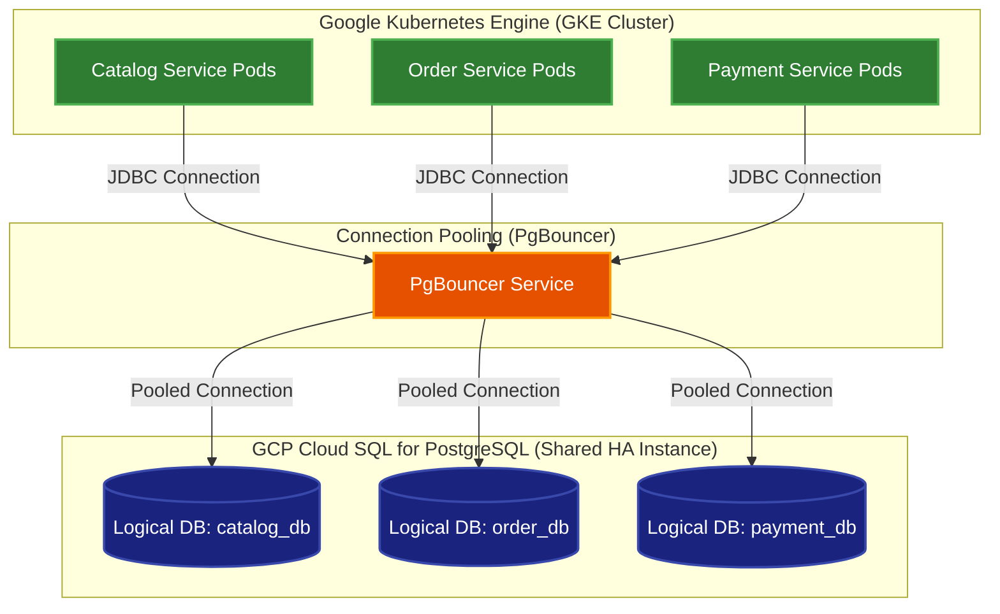
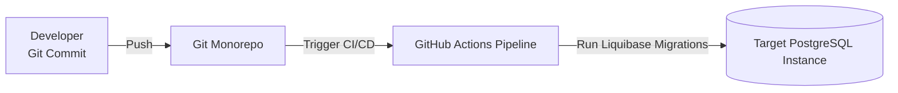

# Abysalto Webshop - PostgreSQL Database Strategy

This document specifies the technical implementation details for the **Logical DB-per-Service on a shared GCP Cloud SQL for PostgreSQL instance** strategy. This approach balances strict database and schema isolation per team domain with cost-optimized, highly available, and standard cloud resource utilization.

---

## 1. Schema Isolation Topology

The system uses a single, shared, high-availability (HA) Google Cloud SQL for PostgreSQL instance. Within this instance, separate, isolated logical databases are created for each microservice. This guarantees schema independence and strict domain boundaries while sharing the database CPU and memory resources. To manage connection limits efficiently, a **PgBouncer** connection pooling layer is deployed in front of the database.



### Key Security & Isolation Features:
*   **Zero Direct Cross-Database Queries:** Microservices can only authenticate to their designated logical database. If `Order Service` needs catalog data, it must call the `Catalog Service` via high-speed internal gRPC APIs. Direct SQL joins across databases are blocked at the networking and authentication level.
*   **Workload Identity Integration:** GKE service accounts are bound to Google Cloud IAM roles, enabling passwordless authentication to Cloud SQL using IAM database login.
*   **Lightweight Pooling (PgBouncer):** Resolves PostgreSQL's process-per-connection architecture limitation, enabling the platform to scale to tens of thousands of concurrent clients without exhaustion.

---

## 2. Team Domain Mapping

To support autonomous, cross-functional development, databases and schemas are partitioned by team domain ownership.

| Team | Service Domain | Logical Database | Primary Tables | Responsibility |
| :--- | :--- | :--- | :--- | :--- |
| **Team A** | Product Catalog | `catalog_db` | `categories`, `products`, `skus` | Catalog search, product metadata, category taxonomies, and basic read-only stock caching. |
| **Team A** | Customers & Profiles | `customer_db` | `customers`, `customer_addresses`, `countries` | Profile management, billing/shipping addresses, global country support flags, regional default localization. |
| **Team B** | Orders & Checkout | `order_db` | `orders`, `order_items`, `order_state_history` | Shopping cart conversion, order state machine, checkout, tax/shipping snapshots. |
| **Team B** | Payments | `payment_db` | `payment_transactions`, `refunds` | Vaulted payment token references, high-security transaction logs, external payment gateway handshakes. |

---

## 3. PostgreSQL Schema Engineering Best Practices

To leverage PostgreSQL effectively under high-concurrency workloads, schemas must follow these specific engineering patterns:

### 3.1. Optimized Data Types (UUID v4)
*   **Primary Key Mandate:** All primary keys must be cryptographically random and non-sequential to support distributed GKE scale. We mandate using PostgreSQL's native `UUID` data type, which is stored as a highly optimized 16-byte binary structure (much faster and more compact than storing strings or VARCHARs).
*   **Auto-generation:** UUID generation is offloaded either to the application layer (Java `UUID.randomUUID()`) or handled natively in the database via the `pgcrypto` or `uuid-ossp` extensions:
    ```sql
    CREATE EXTENSION IF NOT EXISTS "uuid-ossp";
    -- Example ID column: id UUID PRIMARY KEY DEFAULT uuid_generate_v4()
    ```

### 3.2. Covered Indexes via INCLUDE Clause
PostgreSQL supports "Covering Indexes" using the `INCLUDE` clause. This allows us to append non-key payload columns to a B-Tree index, satisfying queries entirely from the index (Index-Only Scan) without fetching the underlying table heap.
*   **Design Pattern:** Index by the search predicate (e.g. `customer_id`) and `INCLUDE` commonly projected fields (e.g. `status`, `total_amount`).
*   **Result:** Extremely fast dashboard lookups and sub-millisecond API response times.

---

## 4. Production-Grade PostgreSQL DDL Examples

### 4.1. Catalog Service Domain Schema (`catalog_db`)
This schema showcases native UUID primary keys, foreign key constraints, and covering indexes using the `INCLUDE` clause.

```sql
-- DDL for catalog_db

CREATE TABLE categories (
    category_id UUID PRIMARY KEY DEFAULT uuid_generate_v4(),
    name VARCHAR(100) NOT NULL,
    slug VARCHAR(120) NOT NULL UNIQUE,
    parent_category_id UUID REFERENCES categories(category_id),
    created_at TIMESTAMP WITH TIME ZONE DEFAULT CURRENT_TIMESTAMP NOT NULL,
    updated_at TIMESTAMP WITH TIME ZONE DEFAULT CURRENT_TIMESTAMP NOT NULL
);

CREATE TABLE products (
    product_id UUID PRIMARY KEY DEFAULT uuid_generate_v4(),
    category_id UUID NOT NULL REFERENCES categories(category_id),
    name VARCHAR(255) NOT NULL,
    description TEXT,
    status VARCHAR(50) NOT NULL, -- ACTIVE, DRAFT, ARCHIVED
    created_at TIMESTAMP WITH TIME ZONE DEFAULT CURRENT_TIMESTAMP NOT NULL,
    updated_at TIMESTAMP WITH TIME ZONE DEFAULT CURRENT_TIMESTAMP NOT NULL
);

-- Covering Index to lookup products by Category with INCLUDE for fast catalog listing queries
CREATE INDEX idx_products_category ON products(category_id) INCLUDE (name, status);

CREATE TABLE skus (
    sku_id UUID PRIMARY KEY DEFAULT uuid_generate_v4(),
    product_id UUID NOT NULL REFERENCES products(product_id) ON DELETE CASCADE,
    sku_code VARCHAR(100) NOT NULL UNIQUE,
    price_numeric NUMERIC(12, 4) NOT NULL,
    price_currency CHAR(3) NOT NULL,
    stock_quantity INT NOT NULL,
    created_at TIMESTAMP WITH TIME ZONE DEFAULT CURRENT_TIMESTAMP NOT NULL,
    updated_at TIMESTAMP WITH TIME ZONE DEFAULT CURRENT_TIMESTAMP NOT NULL
);
```

### 4.2. Order Service Domain Schema (`order_db`)
This schema showcases historical transactional snapshots to guarantee permanent legal compliance without requiring slow cross-database SQL joins.

```sql
-- DDL for order_db

CREATE TABLE orders (
    order_id UUID PRIMARY KEY DEFAULT uuid_generate_v4(),
    customer_id UUID NOT NULL,
    status VARCHAR(50) NOT NULL,             -- CREATED, PAID, SHIPPED, COMPLETED, CANCELLED
    subtotal_amount NUMERIC(12, 4) NOT NULL,       -- Amount before taxes and discounts
    tax_rate NUMERIC(5, 4) NOT NULL,              -- Tax/VAT rate percentage applied (e.g. 0.2000 for 20% VAT)
    tax_amount NUMERIC(12, 4) NOT NULL,            -- Total calculated tax amount
    total_amount NUMERIC(12, 4) NOT NULL,          -- subtotal_amount + tax_amount - discounts
    currency CHAR(3) NOT NULL,                     -- Local transaction currency (ISO 4217, e.g., USD, EUR)
    
    -- Snapped Shipping Destination for global tax & logistics compliance
    shipping_street_line1 VARCHAR(255) NOT NULL,
    shipping_street_line2 VARCHAR(255),
    shipping_city VARCHAR(150) NOT NULL,
    shipping_state VARCHAR(100),              -- e.g., US State for sales tax determination
    shipping_postal_code VARCHAR(20) NOT NULL,
    shipping_country_code CHAR(2) NOT NULL,   -- ISO-3166-1 alpha-2 code (e.g., US, DE)
    
    -- Snapped Billing Information
    billing_country_code CHAR(2) NOT NULL,    -- Required for payment gateway validation
    
    created_at TIMESTAMP WITH TIME ZONE DEFAULT CURRENT_TIMESTAMP NOT NULL,
    updated_at TIMESTAMP WITH TIME ZONE DEFAULT CURRENT_TIMESTAMP NOT NULL
);

-- Covering Index for customer order history queries
CREATE INDEX idx_orders_customer ON orders(customer_id) INCLUDE (status, total_amount, created_at);

-- Covering Index to aggregate sales by target country for financial reporting
CREATE INDEX idx_orders_country ON orders(shipping_country_code) INCLUDE (total_amount, tax_amount, created_at);

CREATE TABLE order_items (
    order_item_id UUID PRIMARY KEY DEFAULT uuid_generate_v4(),
    order_id UUID NOT NULL REFERENCES orders(order_id) ON DELETE CASCADE,
    product_id UUID NOT NULL,
    sku_id UUID NOT NULL,
    quantity INT NOT NULL,
    unit_price NUMERIC(12, 4) NOT NULL,
    tax_amount NUMERIC(12, 4) NOT NULL,            -- Tax/VAT calculated on this item
    snapshot_product_name VARCHAR(255) NOT NULL, -- Snapped product name to avoid cross-domain lookup
    created_at TIMESTAMP WITH TIME ZONE DEFAULT CURRENT_TIMESTAMP NOT NULL
);
```

### 4.3. Customer & Global Localization Domain Schema (`customer_db`)
This schema manages registered customer accounts, their verified addresses, and supported countries.

```sql
-- DDL for customer_db

-- Supported Countries Reference Table (Global Market Configurations)
CREATE TABLE countries (
    country_code CHAR(2) PRIMARY KEY,        -- ISO-3166-1 alpha-2 code (e.g., US, DE, FR, GB)
    name VARCHAR(100) NOT NULL,             -- English localized country name
    default_currency CHAR(3) NOT NULL,      -- Default currency code (ISO 4217, e.g., EUR)
    default_language VARCHAR(5) NOT NULL,   -- e.g., en-US, de-DE, fr-FR
    default_vat_rate NUMERIC(5, 4) NOT NULL, -- Default VAT/Sales Tax rate for checkout estimation
    is_active BOOLEAN NOT NULL DEFAULT TRUE, -- Enables/disables sales to this country
    created_at TIMESTAMP WITH TIME ZONE DEFAULT CURRENT_TIMESTAMP NOT NULL,
    updated_at TIMESTAMP WITH TIME ZONE DEFAULT CURRENT_TIMESTAMP NOT NULL
);

-- Primary Customer Profile Table
CREATE TABLE customers (
    customer_id UUID PRIMARY KEY DEFAULT uuid_generate_v4(),
    email VARCHAR(255) NOT NULL UNIQUE,
    first_name VARCHAR(100) NOT NULL,
    last_name VARCHAR(100) NOT NULL,
    status VARCHAR(30) NOT NULL,            -- ACTIVE, SUSPENDED, PENDING_VERIFICATION
    registration_country_code CHAR(2) NOT NULL, -- Ties user to default billing/compliance laws
    created_at TIMESTAMP WITH TIME ZONE DEFAULT CURRENT_TIMESTAMP NOT NULL,
    updated_at TIMESTAMP WITH TIME ZONE DEFAULT CURRENT_TIMESTAMP NOT NULL
);

-- Customer Address Book
CREATE TABLE customer_addresses (
    address_id UUID PRIMARY KEY DEFAULT uuid_generate_v4(),
    customer_id UUID NOT NULL REFERENCES customers(customer_id) ON DELETE CASCADE,
    address_type VARCHAR(30) NOT NULL,       -- SHIPPING, BILLING, BOTH
    is_default BOOLEAN NOT NULL DEFAULT FALSE,
    recipient_name VARCHAR(200) NOT NULL,
    street_line1 VARCHAR(255) NOT NULL,
    street_line2 VARCHAR(255),
    city VARCHAR(150) NOT NULL,
    state VARCHAR(100),
    postal_code VARCHAR(20) NOT NULL,
    country_code CHAR(2) NOT NULL,        -- References countries(country_code) logically
    created_at TIMESTAMP WITH TIME ZONE DEFAULT CURRENT_TIMESTAMP NOT NULL,
    updated_at TIMESTAMP WITH TIME ZONE DEFAULT CURRENT_TIMESTAMP NOT NULL
);
```

---

## 5. Schema Migration Strategy (Liquibase)

To manage database updates safely across multiple environments without manual intervention, we use **Liquibase** connected directly to each microservice's PostgreSQL target database.



### 5.1. Core Principles of Schema Migrations
1.  **Independent Migration Repositories:** Each microservice module contains its own `db/changelog/` directory containing database-specific SQL/XML change sets.
2.  **No DDL Lockouts:** Most schema adjustments in modern PostgreSQL (such as adding nullable columns or creating indexes with `CONCURRENTLY`) do not block ongoing read/write operations.
3.  **Liquibase Execution:**
    *   During local development, Spring Boot executes changelogs automatically on startup via `spring.liquibase.enabled=true` pointing to local test/Docker PostgreSQL containers.
    *   In Staging and Production environments, migrations are executed as part of the **CI/CD deployment pipeline** using GKE InitContainers before rolling out new service pods, ensuring absolute application-database consistency.
