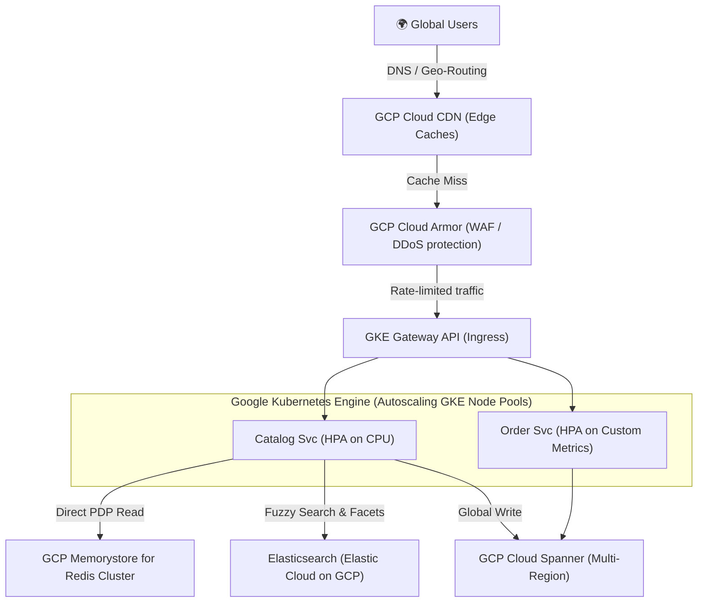
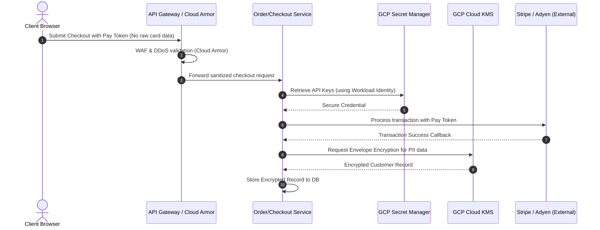
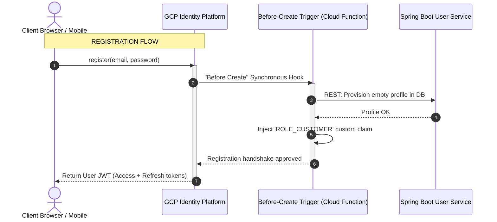
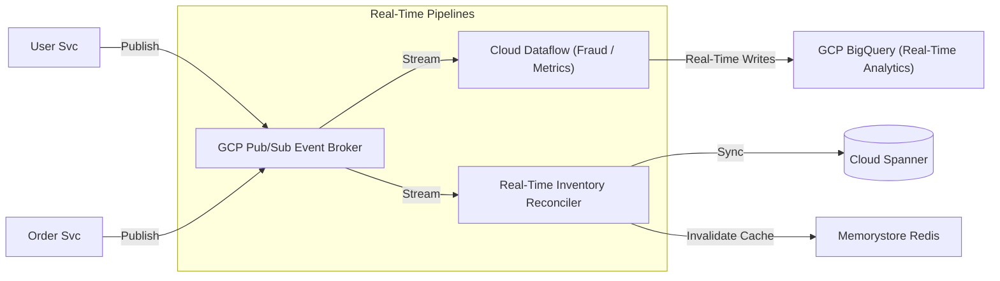

# Abysalto Webshop - Technical Architecture Deep-Dive

This document provides a technical deep-dive into how the Abysalto Webshop architecture implements its three key core requirements on Google Cloud Platform (GCP):
1. **Scalability & Support for High Traffic (Millions of Daily Users)**
2. **Secure Transactions & Data Protection**
3. **Real-Time Data Processing**

---

## 1. Scalability & Support for High Traffic

Serving millions of daily active users requires a system designed for zero single-points-of-failure, sub-second latency, and horizontal elasticity.

### 1.1. Edge-First Delivery & Global Caching
*   **GCP Cloud CDN & Cloud DNS:** Any static website assets (Next.js statically-generated pages, optimized images, bundle assets) are cached globally across Google's 100+ edge points of presence (PoPs). This offloads up to **80% of frontend traffic** from our compute servers.
*   **Dynamic Cache Control:** Catalog APIs utilize fine-grained HTTP Cache-Control headers (`public, max-age=60, s-maxage=300, stale-while-revalidate=60`). This allows safe edge-caching of product details while maintaining rapid updates.

### 1.2. Elastic Compute (GKE Autoscaling)
Our microservices are built on **Spring Boot 3.x** and **Java 21** and deployed on **Google Kubernetes Engine (GKE)**:
*   **Horizontal Pod Autoscaler (HPA):** Pods scale dynamically based on real-time loads.
    *   *Catalog Service:* Scales on standard CPU utilization (target: 70%).
    *   *Order/Checkout Service:* Scales on custom GKE metrics, specifically the number of active HTTP requests or GCP Pub/Sub queue depth.
*   **GKE Cluster Autoscaler & Node Auto-Provisioning:** Dynamically scales the underlying virtual machine instances across multiple availability zones.
*   **GKE Autopilot/Multi-Zonal GKE:** Protects against single-zone outages by distributing replicas evenly across multiple physical zones.

### 1.3. Split-Read Catalog Performance (Redis + Elasticsearch)
To prevent database bottlenecks under heavy write/read traffic, the catalog utilizes a split-read system architecture:
*   **Full-Text Search Engine (Elasticsearch):** All listing and search queries are routed to **Elasticsearch (Elastic Cloud on GCP)**. This offloads resource-heavy search aggregations and text filtering from the relational database.
*   **High-Speed Cache (Redis Cluster):** Direct product detail lookups (by product ID) query **GCP Memorystore for Redis Cluster** first. If a cache miss occurs, the catalog service reads from the transactional database and populates Redis with an explicit TTL (Time-to-Live).
*   **Memorystore High Availability:** Redis is configured with automatic failover, replication, and horizontal sharding, ensuring sub-millisecond response times.

### 1.4. Globally Scalable Relational Database (Cloud Spanner)
Traditional single-instance relational databases become bottlenecks under millions of active users. 
*   **GCP Cloud Spanner** is selected for transactional consistency combined with infinite horizontal scale. We adopt a **Logical DB-per-Service on a Shared Spanner Instance** design to achieve full domain isolation while optimizing cost. For exhaustive design specifications, topology diagrams, DDL patterns, and migration details, see the **[Cloud Spanner Database Strategy](database_strategy.md)**.
*   **Multi-Region Deployment:** Spanner replicates database shards across multiple global regions, offering write-anywhere horizontal scalability and high availability (99.999% SLA) with strong transaction isolation.
*   **Parent-Child Table Interleaving:** Related tables (e.g., `OrderItems` inside `Orders`) are physically interleaved in parent tables. This physically co-locates child rows with their parent rows in storage splits, guaranteeing ultra-fast, single-shard atomic mutations and index lookups.
*   **Hotspotting Mitigation:** Because Cloud Spanner stores data sorted by primary key, sequential keys are strictly forbidden. All schemas mandate cryptographically random **UUID v4 (stored as `STRING(36)`)** for primary keys to distribute write operations evenly across all available database splits.

---

## 2. Secure Transactions & Data Protection

Security is embedded into every layer of the architecture, ensuring absolute data integrity, privacy, and compliance.

### 2.1. Minimizing PCI-DSS Compliance Scope (Tokenization)
To secure payment transactions and maintain minimal audit scope, the system **never processes, transmits, or stores raw credit card details**:
*   **Client-Side Tokenization:** The Next.js frontend communicates directly with verified payment providers (e.g., Stripe, Adyen, or Braintree) using secure iframe or SDK integrations.
*   The payment provider returns a secure, single-use token representing the payment method.
*   Our Spring Boot Order Service receives only this token and submits it via server-to-server API calls to finalize the charge.

### 2.2. Zero-Trust Networking & Secret Management
*   **GCP Cloud Armor:** Protects the public endpoints from OWASP Top 10 vulnerabilities, L3/L4/L7 DDoS attacks, and provides geo-IP blocking and rate limiting.
*   **GCP Secret Manager & Workload Identity:** Spring Boot services do not have hardcoded database credentials or API keys. Services use GKE Workload Identity to securely authenticate to **GCP Secret Manager** to fetch secrets on startup.
*   **Mutual TLS (mTLS):** Enforced inside GKE using an Istio/Anthos service mesh to secure communication between internal microservices.

### 2.3. Data Protection (At Rest & In Transit)
*   **In Transit:** All traffic is encrypted with TLS 1.3. Cloud Load Balancing manages SSL certificates automatically.
*   **At Rest:** GCP encrypts all storage blocks by default. Additionally, for highly sensitive customer data (Personally Identifiable Information - PII), we utilize **envelope encryption** via **GCP Cloud KMS (Key Management Service)**, wrapping data encryption keys (DEK) with central key encryption keys (KEK).

### 2.4. Authentication & Authorization Architecture
To secure public access points and internal systems, authentication (AuthN) and authorization (AuthR) are separated by entry channel and logical scope.

#### 2.4.1. B2C Consumer Security (GCP Identity Platform)
The Web (Next.js) and Mobile applications delegate user storage and credentials verification to **Google Cloud Identity Platform**.

*   **Registration:** The client SDK creates the user on the identity server. Before committing the account, an enterprise **"Before Create" Cloud Function** calls our Spring Boot `User Service` to provision the database profile and injects `ROLE_CUSTOMER` into the JWT claims.
*   **Login & Session:** Users authenticate directly with the IdP (supporting MFA, social logins, and brute-force protection). The client receives a short-lived Access JWT (1-hour expiry) and a long-lived Refresh Token.
*   **Forgot Password:** Managed entirely via the SDK using `sendPasswordResetEmail()`. Google generates a secure, timed reset link and handles SMTP delivery, allowing safe password modification outside our application servers.
*   **Edge Token Verification:** The API Gateway caches the Identity Platform public signing keys (JWKS) to validate signatures locally in **`< 1ms`** without database roundtrips. Upon success, the Gateway strips incoming custom headers and injects secure `X-User-Id` and `X-User-Roles` HTTP headers downstream.

#### 2.4.2. B2B & Marketplace Integrations (GCP Apigee Gateway)
Because automated partner systems require high-volume, machine-to-machine integrations instead of interactive logins, their security bypasses the Identity Platform:
*   **OAuth 2.0 Client Credentials:** Partners request a system-level access token from **GCP Apigee** using pre-shared client credentials.
*   **Mutual TLS (mTLS):** High-value corporate clients authenticate cryptographically at the network handshake level via whitelisted certificate authorities.
*   **Scope-Based Authorization:** Requests are evaluated against OAuth Scopes (e.g., `scope: write:b2b-orders`) rather than human roles. Our Spring Boot controllers assert these permissions using `@PreAuthorize("hasAuthority('SCOPE_write:b2b-orders')")`.

#### 2.4.3. Zero-Trust Internal Communication
To prevent privilege escalation and token expiration failures, **user tokens are never propagated for inter-service communication**.
*   **mTLS Network Mesh:** Pod-to-pod communication inside GKE is encrypted and verified automatically at the network layer using an **Istio Service Mesh**.
*   **Workload Identity:** Downstream services authenticate to GCP services (Cloud Spanner, Pub/Sub, Storage) using GKE Workload Identity, which binds Kubernetes Service Accounts (KSA) directly to secure GCP IAM Roles.

#### 2.4.4. Security Architecture Comparison Matrix

| Sales Channel | Target Audience | Authentication Mechanism | Managed By | Authorization Type |
| :--- | :--- | :--- | :--- | :--- |
| **🌍 Web Shop** | Consumers (B2C) | OAuth 2.1 + PKCE (JWT Bearer) | GCP Identity Platform | User Roles (`ROLE_CUSTOMER`) |
| **📱 Mobile App** | Consumers (B2C) | OAuth 2.1 + PKCE (JWT Bearer) | GCP Identity Platform | User Roles (`ROLE_CUSTOMER`) |
| **🔗 B2B Gateway** | Partner ERPs | Client Credentials / mTLS Handshake | GCP Apigee Gateway | OAuth Scopes (`SCOPE_write:b2b-orders`) |
| **🛒 Marketplaces** | Amazon, eBay, etc. | HMAC Signatures / Secure Webhooks | GCP Apigee Gateway | Webhook-specific Secret Keys |
| **⚙️ Internal Pods** | GKE Microservices | Istio mTLS / Workload Identity | GKE Service Accounts | GCP IAM Roles / GKE KSA |

---

## 3. Real-Time Data Processing

A modern retail experience requires immediate updates for inventory availability, shipment status, and personalized customer recommendations.

### 3.1. Fully Managed Global Event Broker (GCP Pub/Sub)
We leverage **GCP Pub/Sub** as a highly durable, real-time message bus to fully decouple our microservice architecture:
*   **Asynchronous Processing:** Actions like sending order confirmations, updating loyalty points, or initiating merchant notifications are handled out-of-band by subscription workers.
*   **High Throughput:** Pub/Sub natively scales to millions of messages per second with global low latency.

### 3.2. Real-Time Streaming Analytics (GCP Cloud Dataflow)
*   **Streaming ETL:** GCP Cloud Dataflow (built on Apache Beam) continuously consumes streams of events from Pub/Sub.
*   **Real-time Metrics:** Computes rolling aggregations (e.g., hourly sales performance, top-selling items) and writes directly to **Google BigQuery** for immediate executive and operations dashboards.
*   **Fraud Detection Engine:** Dataflow checks order activity streams against fraud rules and ML models, flag suspicious orders instantly for review before order dispatch.

### 3.3. Real-Time Inventory & Stock Coordination
*   To prevent selling out-of-stock items, product quantities are updated in real-time.
*   **Transactional Outbox Pattern:** Spring Boot services write business entities and event records within the same transaction to Cloud Spanner, and a background publisher reads the outbox table to emit events to Pub/Sub.
*   **Instant Cache Eviction:** Once inventory events are received, the Catalog Service invalidates local caches and Redis entries for that product instantly, ensuring subsequent buyers get exact availability data.
