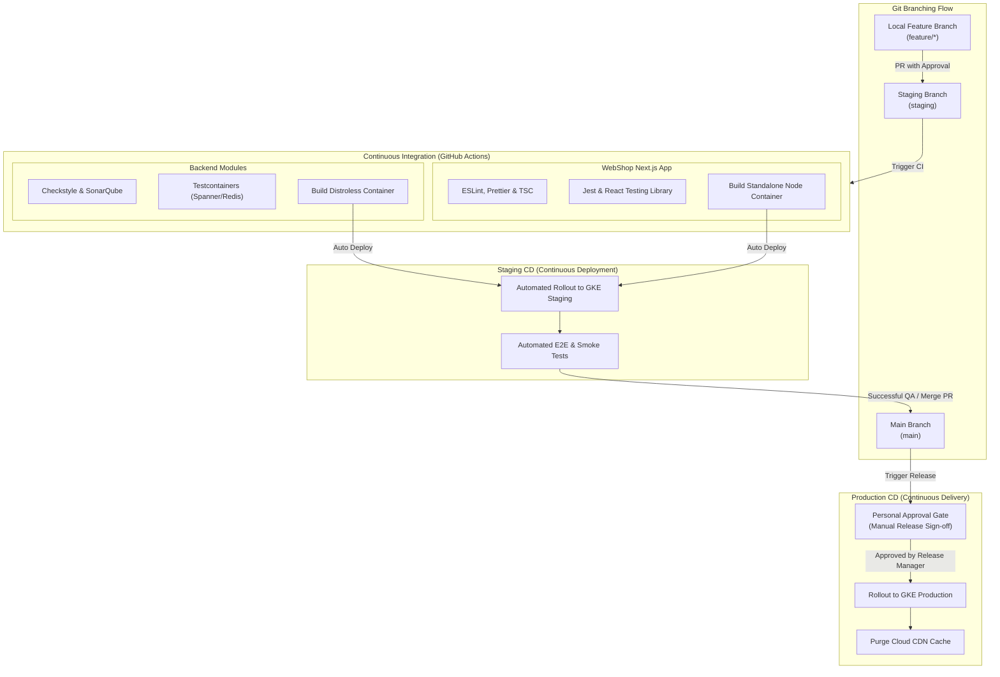

# Abysalto Webshop - Delivery & CI/CD Plan

This document details the branch-to-environment mapping, the promotion workflow, continuous integration steps, and continuous delivery rules for the Abysalto Webshop, including both the **Spring Boot backend microservices** and the **Next.js frontend WebShop application**.

---

## 1. Environments Overview

Our cloud infrastructure on Google Cloud Platform (GCP) is divided into two structurally isolated and securely gated environments to allow safe validation of code before it serves live production traffic.

| Environment | Primary Git Branch | GKE Namespace / GCP Project | Access Control & Security | Purpose |
| :--- | :--- | :--- | :--- | :--- |
| **Staging** | `staging` | `abysalto-staging` | Developer-accessible; simulated test data. | Full end-to-end integration testing, performance validation, and peer QA. |
| **Main (Prod)** | `main` | `abysalto-production` | Restricted; **Requires manual personal approval**; live production data; Cloud Armor activated. | Serving global active users with maximum performance, security, and uptime. |

---

## 2. Multi-Environment CI/CD Workflow

The following lifecycle diagram shows how both backend services and the frontend WebShop app progress from local feature development, through automatic staging deployments, to production deployment gated by human manual approval.



---

## 3. Branching Strategy & Lifecycle Rules

We employ a structured branching model designed to isolate code phases while maintaining high developer velocity.

### 3.1. Short-Lived Feature Branches (`feature/*`)
- Developers work on isolated task branches checked out from `staging`.
- Branches must remain short-lived (**under 2 days of active work**).
- Code is merged into `staging` via a Pull Request (PR) after passing peer review (requires 1 approval) and a preliminary light-weight CI run (unit tests and linting).

### 3.2. Staging Branch (`staging`)
- Serves as the integration trunk where all features are consolidated and validated together.
- **Continuous Deployment (CD):** Any merge or push to `staging` automatically triggers the build and containerization of the updated microservice modules and the Next.js frontend, deploying them immediately to GKE Staging without human intervention.

### 3.3. Main Branch (`main`)
- Represents the stable, production-ready release state.
- Once a release candidate is declared stable in Staging, a Pull Request is opened from `staging` to `main`.
- **Manual Gate Constraint:** Merging to `main` builds production-validated images but does **NOT** deploy them automatically. Deployment is halted until an authorized Release Manager grants **personal, explicit approval** in Google Cloud Deploy.

---

## 4. WebShop Next.js Frontend Deployment Plan

The frontend WebShop Next.js application relies on a combination of Server-Side Rendering (SSR), Incremental Static Regeneration (ISR), and Client-Side rendering. It is containerized and deployed to Google Kubernetes Engine (GKE) behind a **GCP Global External Application Load Balancer with Cloud CDN enabled** to maximize global response speeds.

### 4.1. Next.js Containerization Specification
To ensure lightweight, high-performance containers (under 100MB footprint), we utilize the **Next.js Standalone Output** feature combined with a multi-stage Docker build.

#### Next.js Configuration (`next.config.js`)
```javascript
module.exports = {
  output: 'standalone', // Generates only necessary node_modules & server files
  images: {
    domains: ['storage.googleapis.com'], // Serving assets from GCP GCS
  },
};
```

#### Multi-Stage Dockerfile Layout
```dockerfile
# Stage 1: Dependency Resolver
FROM node:18-alpine AS deps
WORKDIR /app
COPY package.json package-lock.json ./
RUN npm ci

# Stage 2: Production Builder
FROM node:18-alpine AS builder
WORKDIR /app
COPY --from=deps /app/node_modules ./node_modules
COPY . .
ENV NEXT_TELEMETRY_DISABLED 1
ENV NODE_ENV production
RUN npm run build

# Stage 3: Minimal Production Runner
FROM node:18-alpine AS runner
WORKDIR /app
ENV NODE_ENV production
ENV NEXT_TELEMETRY_DISABLED 1

# Create unprivileged runner user for GKE security compliance
RUN addgroup --system --gid 1001 nodejs
RUN adduser --system --uid 1001 nextjs

# Copy only the standalone bundle and static resources
COPY --from=builder /app/public ./public
COPY --from=builder --chown=nextjs:nodejs /app/.next/standalone ./
COPY --from=builder --chown=nextjs:nodejs /app/.next/static ./.next/static

USER nextjs
EXPOSE 3000
ENV PORT 3000
CMD ["node", "server.js"]
```

---

### 4.2. Next.js CI Pipeline Steps
The WebShop frontend CI pipeline executes inside GitHub Actions on every Pull Request to `staging` and `main`:

1. **Linting and Formatting:**
   - Executes ESLint (`npm run lint`) and Prettier validation.
   - Merging is blocked on any code style violation.
2. **Type Checking:**
   - Runs `npx tsc --noEmit` to verify type safety.
3. **Component and Integration Tests:**
   - Executes unit tests via Jest and React Testing Library.
   - Code coverage thresholds must be above **80%** on new components.
4. **Production Build Compilation:**
   - Executes `npm run build` to verify there are no compilation or SSR path errors.
5. **Image Build & Security Scanning:**
   - Compiles the lightweight standalone image and publishes it to **Google Artifact Registry (GAR)**.
   - Automatically scanned for security vulnerabilities.

---

### 4.3. Next.js CD Pipeline & Cache Invalidation

Deploying a frontend application with global caching requires careful cache invalidation to prevent users from seeing outdated visual layouts.

#### 1. Deployment to GKE Staging
- Cloud Deploy deploys the Next.js container tag to the staging namespace in GKE.
- GKE readiness probes check that the application responds with `200 OK` on `/api/health`.
- Once verified, a staging post-deployment script executes to purge the staging CDN caches.

#### 2. Manual-Approval Production Deployment (Main Branch)
- Merges to `main` create a release target in Google Cloud Deploy.
- The rollout enters a **`PENDING_APPROVAL`** state, locking deployment.
- Once a Release Manager reviews the changes and grants **personal approval**, GKE deploys the standalone Next.js instances using a **Canary Strategy** (shifting 10% -> 50% -> 100% traffic via Istio).

#### 3. Automated Cloud CDN Cache Invalidation
Upon 100% deployment completion in Production, the pipeline automatically executes an asynchronous script to purge the CDN cache. This ensures global users instantly access the new frontend code.

```bash
# Automated cache invalidation script triggered post-production deploy
echo "Successful rollout of Next.js WebShop. Purging Cloud CDN global cache..."
gcloud compute url-maps invalidate-cdn-cache abysalto-production-lb-url-map \
    --path "/*" \
    --async
```

---

## 6. Backend microservices CI/CD Specifications

The Spring Boot backend services utilize a similar promotion workflow, but with unique testing paradigms.

1. **Hermetic Integration Tests:** Uses **Testcontainers** to instantiate local Docker instances of Google Cloud Spanner (using the emulator) and Redis. This ensures integrations are tested in true-to-life scenarios without network variance or shared-state corruption.
2. **Secure Containerization:** Spring Boot services are packaged inside **distroless** Java 21 containers (`gcr.io/distroless/java21`), which contain no standard shells, packaging utilities, or diagnostic files. This severely limits the attack surface of the production environment.
3. **Artifact Scanning:** Once pushed to Google Artifact Registry, images undergo static vulnerability analysis. If a critical CVE is detected, the artifact is marked unhealthy and blocked from deployment.
