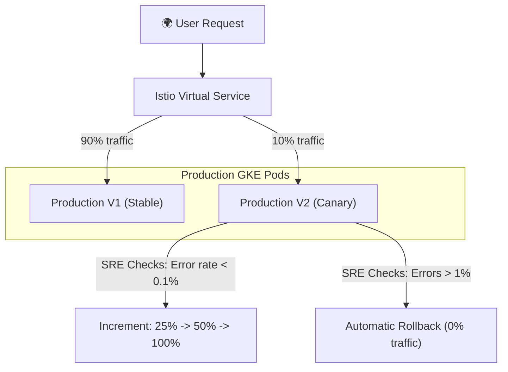

# Abysalto Webshop - Delivery Plan

## Delivery Plan: Branching & CI/CD Pipeline

To enable two separate cross-functional development teams to deploy features autonomously without interfering with each other, we utilize a single Git monorepo utilizing **Trunk-Based Development** paired with an automated **GitOps CI/CD delivery pipeline**.

```mermaid
graph LR
    Dev["Developer Work"] -->|Push Branch| PR["Pull Request to main"]
    
    %% CI Phase
    subgraph CI ["Continuous Integration (GitHub Actions)"]
        PR --> Check["Linter / SonarQube"]
        Check --> Build["Build & Test (Testcontainers)"]
        Build --> Pack["Containerize (Distroless Docker)"]
        Pack --> Vulnerability["GAR Security Scan"]
    end
    
    Vulnerability -->|Success / Merge| GAR["Google Artifact Registry"]
    
    %% CD Phase
    subgraph CD ["Continuous Delivery (Google Cloud Deploy)"]
        GAR --> DeployStaging["Deploy to Staging"]
        DeployStaging --> TestSuite["Automated E2E Tests"]
        TestSuite --> Canary["Canary Release to Prod (GKE / Istio)"]
        Canary -->|A/B Verification| Complete["100% Traffic Rollout"]
    end
```

### 1. Branching Strategy: Trunk-Based Development

We avoid complex GitFlow branch management to prevent integration hell and promote fast feature cycles.
- **The Core Rule:** Developers merge small, frequent commits directly into the **`main` trunk**.
- **Short-Lived Feature Branches:** Feature branches (`feature/feature-name`) are checked out from `main`, must last **no longer than 2 days**, and are merged back into `main` via short, focused Pull Requests (PRs).
- **Branch Protection Rules:**
  - Merging to `main` requires at least one peer approval.
  - All automated CI pipeline checks must pass (no broken builds, no test failures, coverage thresholds met).
- **Feature Flags:** To decouple software releases from GKE deployments, new or risky features are wrapped in feature flags (e.g., using launchDarkly or Unleash). This allows the teams to safely deploy inactive code to production and enable it instantly for specific test cohorts.

---

### 2. Continuous Integration (CI) Pipeline

The CI pipeline runs automatically on GitHub Actions on every Pull Request and commit to the `main` branch.

#### Step 1: Code Verification & Quality
- **Java Checkstyle & Linter:** Enforces codebase standards automatically.
- **Static Analysis (SonarQube):** Analyzes the code to detect bugs, code smells, and security vulnerabilities. The merge is blocked if code coverage on modified files falls below **80%**.

#### Step 2: Automated Testing (Hermetic Environments)
- **Unit Tests:** Executes JUnit 5 suites in isolation.
- **Integration Tests (Testcontainers):** Spins up lightweight docker instances of Google Cloud Spanner (using the official Spanner emulator) and Redis inside the CI runner. This runs true database integrations with zero mock failures.

#### Step 3: Containerization & Security Scanning
- **Multi-Stage Container Builds:** To ensure minimal image footprint and maximize security, the Spring Boot applications are compiled and packaged into secure, **distroless base images** (e.g., `gcr.io/distroless/java21`). Distroless containers contain only our application and its runtime, with no shells or package managers.
- **Artifact Publishing:** Upon a successful merge to `main`, the compiled image is tagged with the Git SHA (e.g., `:sha-e1a5f4c`) and pushed to the secured **Google Artifact Registry (GAR)**.
- **Vulnerability Scanning:** Artifact Registry automatically scans the new container for CVEs. If any critical vulnerabilities are detected, the deployment pipeline is halted, and developers are notified.

---

### 3. Continuous Delivery (CD) Pipeline (GitOps & Canary)

We adopt a declarative **GitOps** approach managed via **Google Cloud Deploy** and GKE.

#### 1. Deployment to Staging
- Cloud Deploy detects the newly verified image tag in GAR and triggers a rollout to the `staging` GKE namespace.
- Git repository changes are applied declaratively.
- Post-deployment integration test suites run automatically against staging to verify end-to-end user flows.

#### 2. Canary Rollouts to Production
To minimize client-facing issues for our millions of daily active users, deployments to `production` utilize **Canary Rollouts** managed via GKE and Istio.

- **Stage 1 (Canary 10%):** Cloud Deploy registers the new service version, and Istio routes exactly **10% of production traffic** to the new container instances.
- **Stage 2 (Observability Window):** The system waits in a holding state for 30 minutes. Automated SRE validation scripts monitor Cloud Monitoring for any spike in HTTP 5xx responses, error logs, or p99 latency spikes on the canary pods.
- **Stage 3 (Progressive Rollout):** If the golden signals remain clean, traffic is stepped up to **25%**, then **50%**, and finally **100%** over the course of 2 hours.
- **Stage 4 (Self-Healing Rollback):** If an anomaly is detected at any step (e.g., error rate exceeds 0.5%), Cloud Deploy triggers an **automatic, sub-second rollback** by restoring Istio traffic weighting to 100% on the stable version, ensuring no users are impacted.
