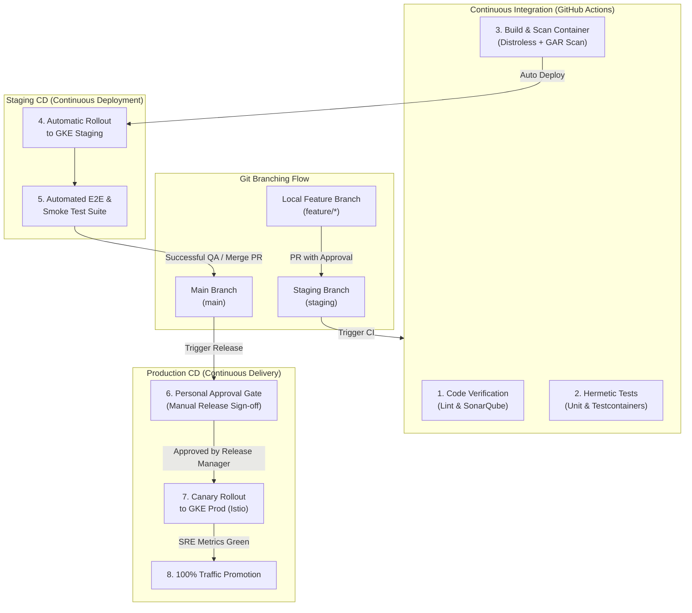

# Abysalto Webshop - Delivery & CI/CD Plan

This document details the branch-to-environment mapping, the promotion workflow, continuous integration steps, and continuous delivery rules for the Abysalto Webshop. To support millions of active users daily and coordinate the output of two cross-functional development teams, we implement a strict git branching model tied to two environments: **Staging** and **Main (Production)**.

---

## 1. Environments Overview

Our cloud infrastructure on Google Cloud Platform (GCP) is divided into two structurally isolated and securely gated environments to allow safe validation of code before it serves live production traffic.

| Environment | Primary Git Branch | GKE Namespace / GCP Project | Access Control & Security | Purpose |
| :--- | :--- | :--- | :--- | :--- |
| **Staging** | `staging` | `abysalto-staging` | Developer-accessible; simulated test data. | Full end-to-end integration testing, performance validation, and peer QA. |
| **Main (Prod)** | `main` | `abysalto-production` | Restricted; **Requires manual personal approval**; live production data; Cloud Armor activated. | Serving global active users with maximum performance, security, and uptime. |

---

## 2. Multi-Environment CI/CD Workflow

The following lifecycle diagram shows how code progresses from local feature development, through automatic staging deployments, to production deployment gated by human manual approval.



---

## 3. Branching Strategy & Lifecycle Rules

We employ a structured branching model designed to isolate code phases while maintaining high developer velocity.

### 3.1. Short-Lived Feature Branches (`feature/*`)
- Developers work on isolated task branches checked out from `staging`.
- Branches must remain short-lived (**under 2 days of active work**).
- Code is merged into `staging` via a Pull Request (PR) after passing peer review (requires 1 approval) and a preliminary light-weight CI run (unit tests and linting).

### 3.2. Staging Branch (`staging`)
- Serves as the integration trunk where all features are consolidated and validated together.
- **Continuous Deployment (CD):** Any merge or push to `staging` automatically triggers the build and containerization of the updated microservice modules, deploying them immediately to GKE Staging without human intervention.
- Developers use this environment to run functional reviews, showcase features, and run automated end-to-end user flows.

### 3.3. Main Branch (`main`)
- Represents the stable, production-ready release state.
- Once a release candidate is declared stable in Staging, a Pull Request is opened from `staging` to `main`.
- **Manual Gate Constraint:** Merging to `main` builds production-validated images but does **NOT** deploy them automatically to the live GKE cluster. Deployment is halted until an authorized Release Manager grants **personal, explicit approval**.

---

## 4. Continuous Integration (CI) Pipeline Detail

The CI pipeline is fully automated and runs inside GitHub Actions runners to produce secure, verified artifacts.

```text
[Commit/Merge] 
   └── Java Linter & Checkstyle (Code quality check)
        └── SonarQube Analysis (Blocks merge if test coverage < 80%)
             └── Hermetic Integration Tests (Spins up Spanner/Redis Testcontainers)
                  └── Multi-Stage Docker Compile (Targets distroless base images)
                       └── Push to Google Artifact Registry (GAR)
                            └── Automatic Vulnerability Scan (Blocks on Critical CVEs)
```

1. **Hermetic Integration Tests:** Uses **Testcontainers** to instantiate local Docker instances of Google Cloud Spanner (using the emulator) and Redis. This ensures integrations are tested in true-to-life scenarios without network variance or shared-state corruption.
2. **Secure Containerization:** Spring Boot services are packaged inside **distroless** Java 21 containers (`gcr.io/distroless/java21`), which contain no standard shells, packaging utilities, or diagnostic files. This severely limits the attack surface of the production environment.
3. **Artifact Scanning:** Once pushed to Google Artifact Registry, images undergo static vulnerability analysis. If a critical CVE is detected, the artifact is marked unhealthy and blocked from deployment.

---

## 5. Continuous Delivery (CD) & Environment Promotion

Our deployment pipelines use declarative **GitOps** principles managed via **Google Cloud Deploy** and GKE.

### 5.1. Automated Staging CD
- **Trigger:** Automatic upon pushing code to the `staging` branch.
- **Action:** Google Cloud Deploy is notified of a new artifact tag in GAR, rendering the GKE manifest, applying it to the `abysalto-staging` namespace, and issuing a rolling update.
- **Verification:** Post-deployment, GKE verifies liveness and readiness probes, and GitHub Actions automatically executes a headless Web Playwright/Selenium test suite to ensure APIs, logins, and cart flows work end-to-end.

---

### 5.2. Gated Production CD (Main Branch)
To protect millions of active users from accidental outages, production rollouts require human intervention and a graduated rollout scheme.

```text
[Merge to main] 
   └── Build Release Target (GAR Tagging)
        └── GCP Cloud Deploy Pipeline Triggered
             └── Pipeline State: PENDING_APPROVAL (Rollout halted)
                  └── release-manager approves rollout manually
                       └── Canary Phase 1: 10% traffic (Istio Service Mesh)
                            └── Automated SRE Observability Verification (15 mins)
                                 └── Progressive Promotion (25% -> 50% -> 100%)
```

#### Step 1: Manual Personal Approval Gate
When a build is initiated on `main`, Google Cloud Deploy automatically configures the release target for the `abysalto-production` environment but pauses it with a `PENDING_APPROVAL` status.
- **Notification:** A webhook fires a notification to the `#release-approvals` Slack channel, tagging the designated Release Managers.
- **Action:** The manager reviews the release package, changelog, and Staging E2E reports. They must navigate to the **Google Cloud Deploy Console** and click the **Approve** button to initiate the deployment.
- **Security:** Permissions to approve releases are managed strictly via GCP Identity and Access Management (IAM) Roles, limiting approval power to authorized engineers (e.g., Lead SRE or Tech Lead) and excluding standard developer accounts.

#### Step 2: Canary Release Strategy
Once personal approval is provided, the rollout begins using **Canary Releases** facilitated by GKE and **Istio Service Mesh**:
- **10% Traffic Window (Phase 1):** Istio shifts exactly 10% of global ingress traffic to the new version (V2), while 90% remains on the stable version (V1).
- **Observability Window:** The canary runs for 15 minutes. Automated Cloud Monitoring telemetry queries the canary pods for the **Four Golden Signals**:
  - *HTTP 5xx Error Rate:* Must be `< 0.1%`.
  - *p99 Latency:* Must remain `< 1200ms`.
  - *Uncaught Exceptions:* Log scraper checking Cloud Logging for new fatal exceptions.
- **Progressive Promotion:** If metrics are healthy, Cloud Deploy increments traffic to **25%**, **50%**, and finally **100%** over a 2-hour window.

#### Step 3: Self-Healing & Automated Rollback
If the canary metrics degrade or trigger an alert policy (e.g., error rate exceeds 0.5% or pod liveness probe fails) during the rollout, GKE and Istio execute an **automatic rollback**:
- Traffic to V2 is instantly choked to `0%`, and 100% of user requests are restored to the stable V1 pods.
- The pipeline status is updated to `FAILED_ROLLBACK`, and a critical alert is sent to PagerDuty to flag the failed deployment.
