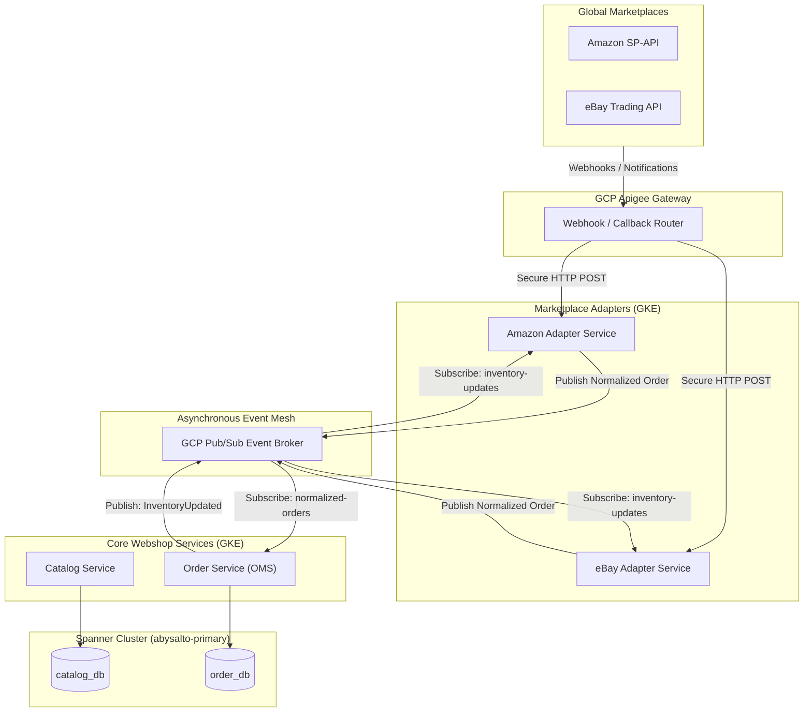
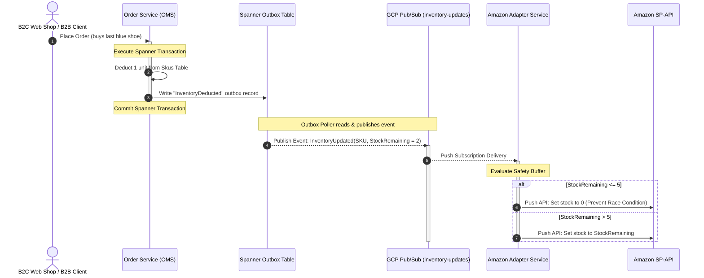

# Abysalto Webshop - Marketplace Integration Architecture

This document specifies the technical design, operational logic, data schemas, and resiliency patterns required to integrate external global marketplaces (e.g., Amazon, eBay, Zalando) with the Abysalto Webshop. The architecture is designed to handle high transaction volumes, prevent inventory overselling, and insulate core systems from external API changes and rate limiting.

---

## 1. Architectural Strategy: The Adapter Pattern

To isolate development cycles, prevent database resource contention, and scale individual marketplace modules independently, the system implements the **Adapter (or Gateway) Pattern**. 

Instead of adding custom, platform-specific code into our core e-commerce services, we isolate each external marketplace's communication into its own lightweight, independent microservice deployed on **Google Kubernetes Engine (GKE)**.



### Key Architectural Benefits:
*   **Domain Isolation:** Core e-commerce services (`order-service`, `catalog-service`) remain pure, dealing only with standardized internal webshop JSON models.
*   **Decoupled Releases:** The GKE deployment for `amazon-adapter` can be updated, redeployed, or scaled down without touching or risking the core checkout engine.
*   **Dynamic Scaling:** If Amazon runs a massive promotional campaign, only the `amazon-adapter` pods scale horizontally based on incoming webhook traffic.

---

## 2. Product Information Management (PIM) & Mapping

Every external marketplace has unique metadata guidelines, categorizations, image sizing limits, and attribute structures. 

### 2.1. Dual-Tier Database Architecture
To handle this taxonomy translation at scale without taxing the high-performance relational `catalog_db` (on Cloud Spanner), we deploy a dual-tier storage strategy:
1.  **Master Product Catalog (Cloud Spanner - `catalog_db`):** Standard relational tables (`Products`, `Skus`) representing the single source of truth for base specifications, prices, and attributes.
2.  **Channel Listing Mapping (GCP Firestore - NoSQL):** A highly flexible, document-oriented database that stores the translated, marketplace-ready payloads.

```text
abysalto-firestore/
├── catalog-mappings/                  # Collection
│   └── [InternalCategoryId]/          # Document
│       ├── amazonCategoryId: "1029482"
│       ├── ebayCategoryId: "829471"
│       └── zalandoCategoryId: "zal-924"
│
└── marketplace-listings/              # Collection
    └── [SkuCode]/                     # Document (e.g., SKU_RUN_100_BLUE)
        ├── amazonListingPayload: { ... Nested JSON for Amazon SP-API ... }
        ├── ebayListingPayload: { ... Nested XML/JSON for eBay ... }
        └── syncStatus: "SYNCHRONIZED"
```

### 2.2. Product Feed Synchronization
A dedicated **PIM Sync Worker** monitors changes inside `catalog_db` via Spanner Change Streams. When a product is modified, the worker:
1.  Fetches category translations from `catalog-mappings`.
2.  Formats the product data into specific JSON/XML schemas matching the target marketplace constraints.
3.  Saves the compiled documents into Firestore (`marketplace-listings`).
4.  Pushes a `ListingUpdateRequired` event to Pub/Sub to trigger the respective GKE Adapter.

---

## 3. Inventory Synchronization & Oversell Prevention

To prevent overselling across multiple global sales channels (and avoid marketplace penalties), stock updates must be processed using **event-driven low-latency streams**, paired with **safety thresholds**.



### 3.1. Transactional Outbox Pattern
To guarantee that every checkout inventory change triggers a synchronization downstream without relying on slow, unreliable dual-database writes:
1.  During checkout, the `order-service` updates inventory in the Spanner `catalog_db` and inserts a message into an `Outbox` table **inside the same ACID transaction**.
2.  A highly optimized background daemon (e.g., running via Debezium or a Cloud Run Spanner Event Poller) reads the outbox table and publishes an `InventoryUpdated` event to the `inventory-updates` Pub/Sub topic.
3.  The marketplace adapters consume this event to push real-time stock levels back to the external networks.

### 3.2. Intelligent Inventory Buffers & Throttling
To respect third-party API rate limits and avoid race conditions when stock levels run critically low, adapters apply the following logic:
*   **The Safety Buffer:** If the Master Catalog inventory for an item drops **below 5 units**, the Adapter automatically reports **`0`** to the marketplace. This reserves the remaining units for our direct channels (Next.js/B2B) and completely eliminates checkout race conditions.
*   **Throttling Thresholds:**
    - If stock is high ($>100$), only push updates to marketplaces when stock changes by more than $10\%$ (or once per day).
    - If stock is medium ($15 \le \text{stock} \le 100$), update when stock changes by more than $5$ units.
    - If stock is low ($< 15$), update on **every single unit change** instantly.

---

## 4. Centralized Order Management System (OMS)

Orders originating from external platforms must be translated into our internal data standards before entering GKE services.

### 4.1. Order Ingestion Pipeline
1.  **Ingestion Endpoints:** Lightweight, highly available GKE pods on the Adapters layer expose secure endpoints to receive marketplace webhooks (or poll marketplace order APIs every 60 seconds).
2.  **Normalization:** The Adapter parses the external schema (e.g., converting Amazon’s `AmazonOrderId`, `PurchaseDate`, and customized tax layouts) into our standard internal JSON structure.
3.  **Durable Pub/Sub Buffering:** The normalized JSON is published to the `marketplace-orders-normalized` Pub/Sub topic.
4.  **Idempotence Assertion:** The `order-service` consumes the topic. Before writing to the `order_db` on Spanner, it verifies if an order with the metadata key `originChannelId` + `externalOrderId` already exists. This guarantees that duplicate webhooks never generate duplicate orders.

```json
{
  "sourceChannel": "AMAZON_US",
  "externalOrderId": "114-1294829-2849204",
  "customerId": "external_amazon_customer_id",
  "currency": "USD",
  "subtotalAmount": 49.99,
  "taxAmount": 4.50,
  "totalAmount": 54.49,
  "shippingAddress": {
    "street1": "123 Main St",
    "city": "Seattle",
    "state": "WA",
    "postalCode": "98101",
    "countryCode": "US"
  },
  "items": [
    {
      "skuCode": "SKU_RUN_100_BLUE",
      "quantity": 1,
      "unitPrice": 49.99
    }
  ]
}
```

### 4.2. Shipment & Tracking Synchronization
Once a fulfillment center ships an order, the `order-service` publishes an `OrderShipped` event containing the carrier name and tracking number.
1.  The `amazon-adapter` consumes the `OrderShipped` event.
2.  It converts this payload into the Amazon Selling Partner API envelope format.
3.  It schedules a call to the SP-API `Feeds` endpoint to submit the tracking record, marking the order as fulfilled on Amazon's dashboard.

---

## 5. Resiliency, Rate Limiting & Throttling

External marketplace APIs are highly prone to transient failures, network latency, and strict API call quotas.

### 5.1. Queue-Based Rate Limiting (GCP Cloud Tasks)
Because APIs like Amazon SP-API have strict bucket rate limits (e.g., maximum 5 requests per second), adapters do not execute HTTP calls directly on GKE application threads. Instead:
1.  Adapters wrap the API request into a **GCP Cloud Task**.
2.  GCP Cloud Tasks queues are configured with native rate limits matching the target platform's specifications (e.g., `max_dispatches_per_second: 5`).
3.  This guarantees that our systems never breach external rate limits, regardless of internal peak checkout loads.

### 5.2. Retries, Jitter & Circuit Breakers
For transient network timeouts (HTTP 500/503) or unexpected rate limiting (HTTP 429):
*   **Exponential Backoff with Jitter:** Retries are executed on an exponential curve (e.g., $2s, 4s, 8s, 16s...$) up to a maximum delay of 1 hour, adding random variation ("jitter") to prevent synchronized retry waves.
*   **Dead-Letter Queues (DLQ):** If a task fails continuously 10 times, it is moved to a Dead-Letter Queue (GCS bucket/Pub/Sub topic) for automated alerts and manual support investigation, preventing loss of sync messages.
*   **Circuit Breakers (Resilience4j):** If the external platform goes offline completely, the GKE adapter trips the circuit breaker, stopping all queue dispatching for 5 minutes to allow the external system to recover.

---

## 6. Next Steps & Timeline
1.  **Deploy Firestore Schema:** Initialize the `catalog-mappings` NoSQL structures in GCP.
2.  **Mock Adapters Development:** Create a stubbed GKE mock adapter simulating Amazon SP-API responses to validate rate-limiting logic on GCP Cloud Tasks.
3.  **Outbox Implementation:** Add the Spanner transactional outbox tables and event emitters in the microservices pipeline.
