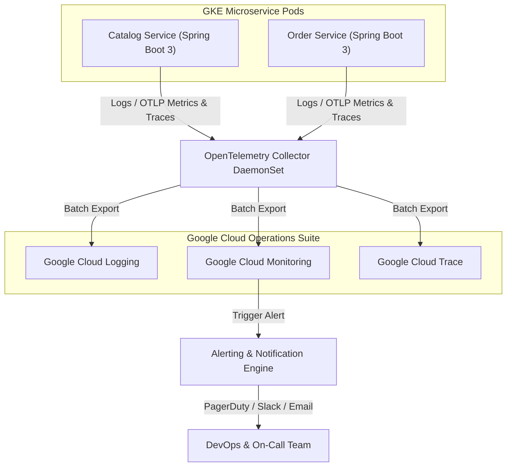

# Abysalto Webshop - Monitoring & Observability Plan

This document details the observability architecture, health checking mechanisms, and alert management for the Abysalto Webshop. To support millions of active users daily and maintain a stable, resilient platform, we deploy automated, self-healing container infrastructure coupled with a comprehensive telemetry stack.

---

## 1. System Observability & Monitoring

Our observability model is built on standard open protocols (**OpenTelemetry**) and integrated with the native **Google Cloud Operations Suite** (Cloud Logging, Cloud Monitoring, Cloud Trace, Cloud Profiler) to ensure complete visibility across microservices with zero vendor lock-in.



### 1. The Three Pillars of Observability

#### 1. Distributed Tracing (Latency & Dependency Tracking)
- **Framework:** Standard Java microservices use **Micrometer Tracing** (bridging to OpenTelemetry) to propagate context.
- **Trace Context Propagation:** Every external request passing through the API Gateway is injected with a standard W3C Trace Context header (`traceparent`). This token traverses down through the Spring Cloud Gateway (BFF), inter-service gRPC calls, Pub/Sub events, and database actions.
- **Backend Storage:** Traces are batch-exported to **Google Cloud Trace**. Developers can visualize a user's entire checkout journey, pinpointing exactly which microservice or PostgreSQL database query added latency.

#### 2. Centralized Metrics (Performance & Sizing)
- **Framework:** **Spring Boot Actuator** combined with **Micrometer** aggregates application-level statistics.
- **Collector Pattern:** GKE runs an OpenTelemetry Collector agent as a DaemonSet. It scrapes standard Prometheus-formatted metrics exposed by the microservices (via `/actuator/prometheus`) and ships them to **Google Cloud Monitoring** workspace.
- **System Metrics:** Host/Node CPU, memory saturation, container network traffic, and disk IO are gathered natively via GKE-native monitoring metrics.

#### 3. Structured Logging (Context & Troubleshooting)
- **Framework:** Spring Boot uses Logback with a logstash-logback-encoder to output structured **JSON logs** on `stdout`.
- **Fields Logged:**
  - `timestamp`: RFC 3339 format.
  - `severity`: Standard syslog severity levels (`INFO`, `WARN`, `ERROR`).
  - `service_id`: Name of the microservice (e.g., `order-service`).
  - `trace_id` & `span_id`: Correlated with distributed tracing.
  - `message`: Clear human-readable text.
  - `exception`: Full stack traces included as structured JSON objects upon error.
- **Ingestion:** GKE FluentBit/fluentd logging agents capture container standard outputs and stream them immediately into **Google Cloud Logging** for indexing and long-term retention.

---

### 2. Health Checking & Self-Healing

To guarantee high availability and enable zero-downtime rolling deployments, GKE depends on highly accurate container health endpoints. We leverage **Spring Boot Actuator Health Indicators** configured as separate Kubernetes probes.

```yaml
# GKE Deployment Probe Configuration (Example)
apiVersion: apps/v1
kind: Deployment
metadata:
  name: order-service
spec:
  template:
    spec:
      containers:
      - name: order-service
        image: gcr.io/abysalto-webshop/order-service:latest
        livenessProbe:
          httpGet:
            path: /actuator/health/liveness
            port: 8080
          initialDelaySeconds: 30
          periodSeconds: 10
        readinessProbe:
          httpGet:
            path: /actuator/health/readiness
            port: 8080
          initialDelaySeconds: 15
          periodSeconds: 10
          failureThreshold: 3
```

#### Liveness Probes (`/actuator/health/liveness`)
- **Purpose:** Verifies if the Java Virtual Machine is running and healthy.
- **Logic:** Quick, lightweight check that does not verify external databases or third-party connections. If it fails (e.g., due to an out-of-memory error or deadlock), GKE restarts the container instantly.

#### Readiness Probes (`/actuator/health/readiness`)
- **Purpose:** Verifies if the container is fully prepared to handle consumer requests.
- **Logic:** Performs deep checks against active connections:
  - Can it successfully connect to the service's logical PostgreSQL database?
  - Is the Redis cluster cache pingable?
  - Is the connection to GCP Pub/Sub broker established?
- **Behavior:** If any downstream dependency is broken, GKE stops routing HTTP/gRPC traffic to this specific pod replica, preventing checkout or catalog errors, while other healthy pods process the volume.

---

### 3. Alerting & The "Golden Signals"

Our SRE operations center on Google Cloud Monitoring alert policies configured against the **Four Golden Signals**:

| Signal | Metric Inspected | Threshold Policy | Action |
| :--- | :--- | :--- | :--- |
| **Latency** | HTTP/gRPC Request Duration (p95 / p99) | `p99 Latency > 1500ms` for 5 consecutive minutes. | PagerDuty (High Priority) |
| **Traffic** | Request Rate (HTTP requests per second) | Dynamic baseline anomaly detection (`+/- 40%` deviance). | Slack Notification |
| **Errors** | HTTP 5xx error rate / gRPC Status non-OK | `HTTP 5xx rate > 1%` of total traffic for 2 minutes. | PagerDuty (High Priority) |
| **Saturation** | Pod CPU & Memory limits / DB Connection Pool | `CPU / Memory Usage > 85%` or Cloud SQL PostgreSQL CPU utilization `> 80%`. | Slack + Auto-scale Trigger |

- **Alert Routing:**
  - **High Severity (P1):** Triggers PagerDuty to wake up the on-call engineer and notifies the DevOps Slack channel.
  - **Warning Severity (P2):** Dispatches alerts directly to dedicated MS Teams/Slack channels and logs tickets in Jira for development triage.
