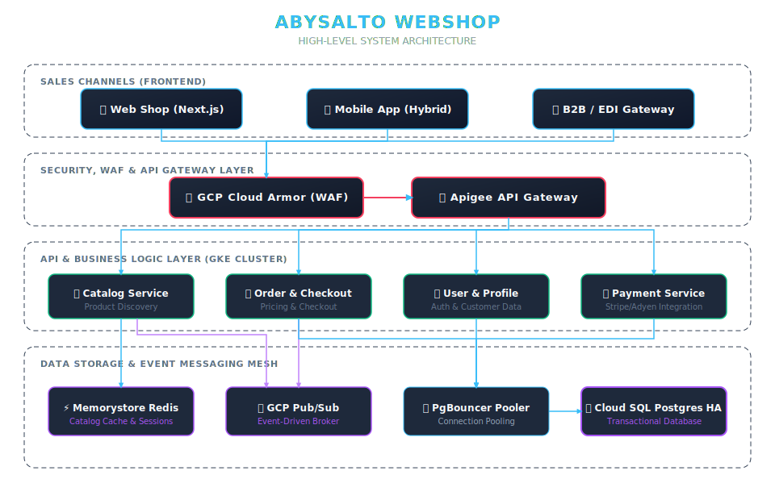

# 🌍 Abysalto Webshop
## High-Level Architectural Design & Vision
**System design, scaling strategy, and delivery plan for millions of daily active users.**

*Presented by the System Architecture Team*

---

## 1. Executive Summary & Goals

*   **Extreme Scale:** Support millions of daily active users globally with ultra-low latency.
*   **Omnichannel Support:** Consistent retail logic across Web, Mobile, Marketplaces, and B2B systems.
*   **Security-First Architecture:** PCI-DSS compliance, DDoS/WAF protection, and enterprise-grade isolation.
*   **Standard, Open Tech Stack:** Multi-module Spring Boot monorepo, Next.js, and HA **PostgreSQL** on Google Cloud.

---

## 2. Architectural Overview

<div class="grid">
<div>

### Technology Stack
*   **Frontend:** Next.js (SSR/ISR) & Generic Native/Cross-Platform Mobile
*   **Backend:** Spring Boot 3.x (Java 21)
*   **Primary DB:** GCP Cloud SQL (PostgreSQL)
*   **Caching:** GCP Memorystore for Redis (including Real-Time Page Views Counters)
*   **Event Broker:** GCP Pub/Sub
*   **Edge:** Apigee, Cloud CDN, Cloud Armor

</div>
<div>

### Architectural Principles
*   **Global Distribution** via GCP Anycast IP & CDN.
*   **Standard SQL Scalability** with highly-available Postgres, read-replicas, and PgBouncer.
*   **Event-Driven Design** to decouple background processing.

</div>
</div>

---

## 3. High-Level Architecture Diagram



*(All frontend connections are routed securely through edge DDoS, WAF, and API Gateway layers).*

---

## 4. Scaling Strategy

To handle high traffic volume spikes and flash sales:

*   **HA Cloud SQL (PostgreSQL):** High-Availability multi-zone clustering paired with geographical **Read Replicas** to scale read traffic.
*   **PgBouncer Pooling:** Manages and reuse massive database connection pools from containerized microservices.
*   **GCP Memorystore for Redis:** Ultra-fast read cache for catalog lookups combined with a **Redis Buffered Counter Pattern** for high-volume real-time page views tracking.
*   **GCP Cloud CDN:** Leverages Next.js static asset and ISR optimization for sub-second, edge-cached content delivery.

---

## 5. Security & Authentication

*   **Edge Defense:** **GCP Cloud Armor** filters bad traffic at the network edge using pre-configured OWASP top-10 rules.
*   **Identity Management:** **GCP Apigee** handles secure OAuth2 / OpenID Connect (OIDC) verification and rate limits downstream APIs.
*   **Compliance & Vaulting:** 
    *   No cardholder data is stored locally; checkout transactions are securely offloaded to PCI-DSS compliant providers (Stripe/Adyen).
    *   Secrets and database credentials are fully isolated inside **Google Cloud KMS** with envelope encryption.

---

## 6. Key Components (GKE Microservices)

Our multi-module monorepo contains decoupled domain services *(Note: Codebase currently implements core `catalog` & `shopping-cart` MVP services)*:

*   **Catalog Service:** Manages product discovery, category indexing, and Redis cache synchronization.
*   **Order & Checkout Service:** Evaluates promotional rules, orchestrates transaction state, and saves order details to PostgreSQL.
*   **User & Profile Service:** Maintains profiles, shipping details, and corporate partner permissions.
*   **Payment Gateway Service:** Interfaces with tokenized payment channels securely.
*   **Notification Service:** Multi-channel notification engine consuming async Pub/Sub topics.

---

## 7. External Integrations

<div class="grid">
<div>

### 🛒 Marketplaces & B2B
*   **B2B / EDI Gateway:** Custom endpoint for bulk orders, supporting custom account structures and negotiated contract pricing.
*   **Marketplace Adapters:** Syncs pricing, inventory, and imports external orders (e.g. Amazon, eBay) using background worker loops.

</div>
<div>

### 🏛️ Fiscalization & Taxes
*   **Tax Administration Integration:** 
    *   A secure Tax Adapter connects to official tax authorities.
    *   Calculates local tax rates and submits fiscalized invoices synchronously during checkout validation.

</div>
</div>

---

## 8. Monitoring & Observability

*   **OpenTelemetry Standard:** Agent-less metrics and tracing collection with zero vendor lock-in.
*   **Distributed Tracing:** Micrometer Tracing context propagation using W3C standard `traceparent` header across microservices and DB connections.
*   **Health Probes:** Spring Boot Actuator liveness (`/actuator/health/liveness`) and readiness probes used by GKE for self-healing.
*   **Central Alerts:** Automated alerts shipped directly to PagerDuty and Slack when performance SLA breaches are detected.

---

## 9. Delivery Plan & CI/CD Pipelines

```text
Feature Branch -> Pull Request -> CI Tests -> Merge -> GKE Staging -> Manual Approval Gate -> GKE Production
```

*   **Robust CI:** GitHub Actions performs Checkstyle, SonarQube quality checks, and runs integrations via local **Testcontainers** (including local PostgreSQL & Redis).
*   **Continuous Deployment to Staging:** Merges to `staging` are automatically built into distroless containers and pushed to GKE Staging.
*   **Safe Promotion to Production:** Releases are built from `main` branch, packaged securely, and await **manual release sign-off** before running rolling zero-downtime updates in GKE Production.

---

# 🚀 Thank You!
## Questions & Discussion

*Let's build the future of global retail together.*
