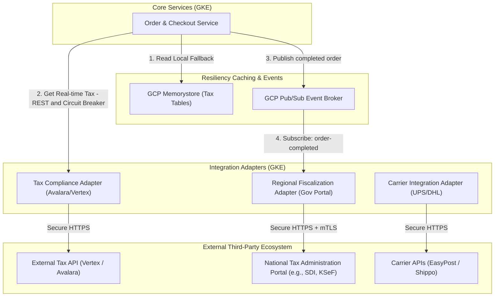
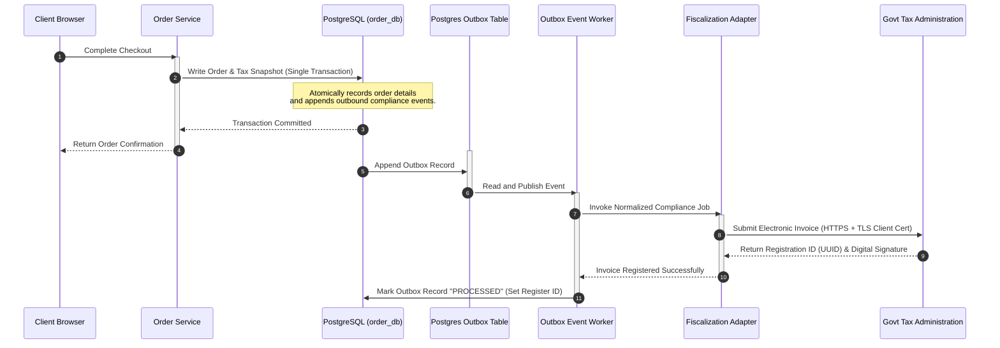

# Abysalto Webshop - Third-Party Integration Strategy

This document details the architectural patterns, integration pipelines, and resiliency systems used to connect the Abysalto Webshop with external third-party systems. Key areas of focus include **Tax Administration and Compliance** (real-time tax calculations, electronic invoicing, and regional fiscalization), ERP integration, and shipping carriers.

---

## 1. Architectural Strategy: Isolated Adapter Pattern

To insulate the high-performance core e-commerce backend from external latency spikes, network failures, and vendor-specific data structures, the platform utilizes the **Adapter (or Gateway) Pattern**. 

All communication with external third-party services is managed by standalone, lightweight microservices deployed to **Google Kubernetes Engine (GKE)**. Core business domains (such as `order-service` or `payment-service`) only interact with standardized internal JSON schemas and never connect directly to third-party endpoints.



---

## 2. Real-Time Checkout Integrations (Synchronous Path)

Certain integrations, such as tax/VAT calculation or real-time shipping rate computation, reside directly on the synchronous checkout path. Any latency or downtime in these external services directly threatens conversion rates.

### 2.1. Circuit Breaker & Timeout Configuration
To ensure a high-performing checkout experience, the platform enforces strict service levels using **Resilience4j** in our Spring Boot adapters:

*   **Strict Timeouts:** Direct calls to external tax/shipping APIs are capped at a **500ms timeout budget**. If the adapter does not respond within this window, the connection is aborted.
*   **Circuit Breakers:** If the error rate for external calls exceeds **20%** over a sliding window of 100 requests, the circuit breaker trips (opens), instantly failing fast and routing requests to the offline fallback layer.
*   **Rate Limiting & Throttling:** Adapters actively monitor and enforce vendor-specific rate limits using sliding-window rate limiters.

### 2.2. Offline Fallback & Estimator Engine (Tax Resilience)
If the circuit breaker opens or a timeout is triggered, the `Order Service` falls back gracefully to a localized **Tax Estimator Engine**:

1.  **Cached Tax Tables:** A lightweight cron job runs every 24 hours to download generalized regional sales tax / VAT rates from our tax provider and writes them into **GCP Memorystore for Redis** (with backup persistence in PostgreSQL).
2.  **Estimation Logic:** If the external API is unreachable, the system queries the local cache using the customer's `ShippingCountryCode` and `ShippingPostalCode` / `ShippingState` to apply a safe, highly accurate estimated tax.
3.  **Audit Flagging:** The order is flagged in `order_db` with `TaxCalculationMethod = "ESTIMATED"`.
4.  **Asynchronous Reconciliation:** Once the order is placed, an asynchronous background job re-submits the invoice to the tax portal for exact, final tax calculation, adjusting the final accounting ledger records in the background without affecting the user's checkout experience.

---

## 3. Asynchronous Compliance & Reporting (Electronic Invoicing & Fiscalization)

Many countries (e.g., Italy's SDI, Poland's KSeF, or Mexico's SAT) mandate that e-commerce merchants submit digital invoices or fiscal records in near-real-time directly to government servers. This reporting must happen after order finalization and must guarantee reliable, once-and-only-once delivery.

### 3.1. The Transactional Outbox Pattern
To prevent distributed transaction failures, we do not call the government compliance APIs directly inside the database transaction. Instead, we implement the **Transactional Outbox Pattern**:



### 3.2. Deduplication & Idempotency
Because government networks frequently experience transient network dropouts and timeouts, the `Fiscalization Adapter` must enforce absolute idempotency:
*   **Deterministic Transaction IDs:** Every submission payload includes an `Idempotency-Key` formed by hashing the internal Order ID and the state version (`UUID-v4` or `order-id_hash`).
*   **Two-Phase Registration:** If an API call to a state portal times out, the adapter queries the government endpoint using the `Idempotency-Key` to verify if the document was already processed before attempting a re-submission.
*   **Dead Letter Queues (DLQs):** Events that fail after 5 retries are moved to a dedicated GCP Pub/Sub Dead Letter Topic (`fiscal-reporting-dlq`). Compliance officers are immediately alerted via **Cloud Monitoring / PagerDuty** to resolve tax issues manually before monthly filing deadlines.

---

## 4. Normalized Data Schemas

To maintain standard interfaces across all integration adapters, the core services utilize generic, highly descriptive request and response structures.

### 4.1. Tax Calculation Request Payload
This schema is passed from the `Order Service` to the `Tax Compliance Adapter`:

```json
{
  "transactionId": "ord_9a8b7c6d-5e4f-3a2b-1c0d-9e8f7a6b5c4d",
  "transactionDateTime": "2026-06-29T18:40:00Z",
  "currency": "USD",
  "originAddress": {
    "streetAddress": "100 Google Way",
    "city": "Mountain View",
    "state": "CA",
    "postalCode": "94043",
    "country": "US"
  },
  "destinationAddress": {
    "streetAddress": "555 Broadway",
    "city": "New York",
    "state": "NY",
    "postalCode": "10012",
    "country": "US"
  },
  "items": [
    {
      "itemId": "sku_run_100_blue",
      "taxCode": "PC040100",
      "quantity": 2,
      "unitPrice": 120.00,
      "discountAmount": 10.00
    }
  ]
}
```

### 4.2. Tax Calculation Response Payload
The normalized output returned by the `Tax Compliance Adapter`:

```json
{
  "transactionId": "ord_9a8b7c6d-5e4f-3a2b-1c0d-9e8f7a6b5c4d",
  "subtotalAmount": 230.00,
  "taxAmount": 20.41,
  "totalAmount": 250.41,
  "calculationMethod": "EXTERNAL_API",
  "taxDetails": [
    {
      "itemId": "sku_run_100_blue",
      "rate": 0.08875,
      "amount": 20.41,
      "taxAuthority": "NEW YORK STATE / CITY"
    }
  ]
}
```

---

## 5. Security & Key Management

When interfacing with regional tax administrations and billing networks, maximum compliance and security are non-negotiable.

1.  **Workload Identity-Based Vaulting:** Third-party credentials, client SSL keys, and government-issued API certificates are stored inside **GCP Secret Manager**. Microservices running on GKE use GCP Workload Identity to fetch secrets dynamically without persisting keys on disks.
2.  **mTLS and Client Certificates:** Government portals typically mandate mutual TLS (mTLS) with custom client certificates. The GKE Ingress or Apigee Proxy manages these certificates securely, automatically rotating them via Cloud KMS/Keyring integration.
3.  **GDPR & Data Privacy:** Personal Identifiable Information (PII) like customer names or precise home addresses are tokenized or generalized before transmission to external auditing APIs where legally permissible.
